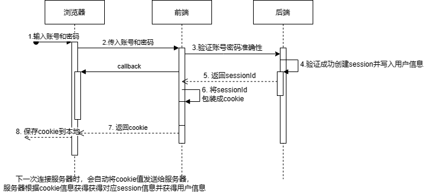

## 请你说一下Cookie和Session之间的区别和关系

相同之处：Cookie和Session都是维护用户身份的会话方式。

不同之处：具体维护方式不同。

Cookie的具体方式：浏览器第一次访问服务端，服务端将用户信息返回给浏览器，浏览器使用cookie记录该用户信息；在下一次与服务器通信时，在请求头中的cookie里携带用户信息；服务器解析改cookie信息，获取到用户的身份和权限相关信息，从而直接返回改用户相关的界面。

Cookie的生命周期：

* 会话cookie：在默认不进行设置过期时间的情况下，cookie的生命周期是浏览会话期间，在浏览器关闭后，cookie就会消失，这种类型的cookie称为会话cookie，它只存在于内存中
* 持久化cookie：在设置过期时间后，cookie有了有效期，在这个有效期内，cookie会存储到浏览器端的磁盘中持久化保存，直到过期。

Session的具体方式：在浏览器第一次访问服务端，通过服务端校验后，服务器中有个session对象，记录下用户的身份信息；然后返回给浏览器一个sessionId，这个sessionId与生成的session对象一对一的绑定；然后将sessionId封装到cookie中；下一次浏览器访问服务端时，携带的cookie中有sessionId，通过该sessionId，可以找到session对象，如果成功找到，即可直接返回用户相关的界面。

