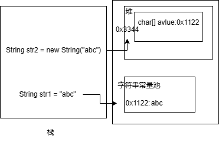
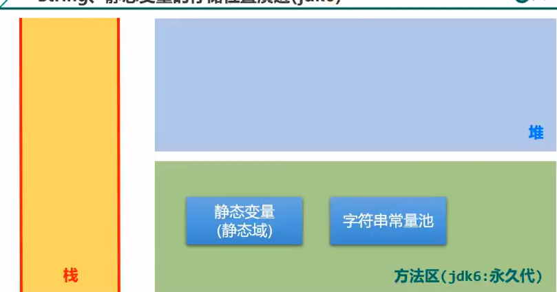
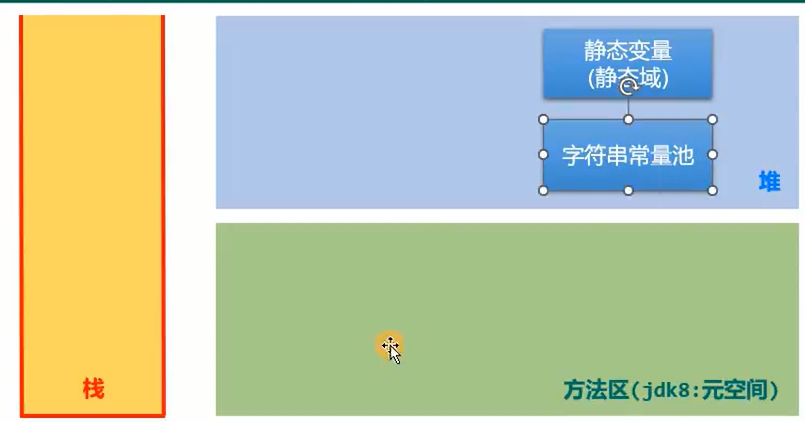

## String类

### 类的基本定义

```java
public final class String implements java.io.Serializable,Comparable<String>,CharSequence
```

* `final`表示String类不可继承
* String实现了Serializable接口表示字符串是支持序列化的。实现此接口的类的对象就可以通过网络或本地流进行数据的传输
* Comparable：凡是实现此接口的类，其对象都可以比较大小

### 底层实现

String类数据在底层是以一个数组作为存储的容器的。在JDK8及之前，底层存储方式是`private final char value[] `;在jdk8之后，存储方式是`private final byte value[]`。

### String的不可变性

不管是jdk8之前还是之后，用来存储字符串的数组都是用final来修饰。这表明**一旦对String赋值后，生成的字符串保存在value数组中，将无法被更改**。

不可变性的具体表现在：

1. 对String字符串的值进行不同的操作最终导致变量值的修改，最终都会导致在字符串常量池中创建新的字符串常量值，而原来的变量值仍然在字符串常量池。

   ```java
   String a = "hello";//字符串常量池中有了一个新的值hello
   a = "world";//字符串常量池中有了一个新的值world
   ```

2. 当对现有的字符串进行连接操作`concat` `s1+s2`时也需要**重新指定内存区域赋值**，不能使用原有的字符串地址进行。

3. 调用String的replace()方法修改指定字符或字符串时也**需要重新指定内存区域**

4. 如果有多个变量创建了相同的字符串，那么返回的都是这个唯一字符在字符串常量池中的内存地址值

   ```java
   String s1 = "abc";//字面量的定义，声明一个不同的不同字符串，会在字符串常量池中创建
   String s2 = "abc";//在字符产常量池中已经创建了abc字符串，所以直接返回abc的内存地址值
   ```

### 不同实例化方法的对比

> 即String s1 = "abc"和String s2 = new String("abc")的区别

区别：通过字面量定义的方式，会设置一个final修饰的char[]数组存放在方法区中的字符串常量区中；而采用new+构造器的方式则是在堆中声明一个String类对象，开辟对应的内存空间，其中有属性char[]数组，是引用数据类型，**可以指向字符串常量池**。

> String s = new String("abc")在内存中创建了几个对象？

分别是在堆中创建了String类对象s,在方法区的字符串常量池中创建了字符串"abc"(如果之前字符串常量池已经出现了abc则不会再创建)。



### 字符串常量池的位置

字符串常量池是jvm专门开辟的一个内存空间用来存放不同的String字符串。在JDK6及之前，字符串常量池存放在方法区（也叫永久代）中；在JDK6之后，字符串常量池放到了堆中。主要原因是为了更方便进行GC。





### String与其他结构的转换

1. String转换为其他基本类型、包装类如int ，调用包装类静态方法parseXxx(str): `int num = Integer.pareInt(str1)`
2. 基本数据类型、包装类转换成String 调用String重载的valueOf():`String str = String.valueOf(num)`或者` String str = num +""`
3. String与字符数组之间的转换:String转化成char[]，调用String的`toCharArray()`方法;char[]转化为String，调用String构造器,`String str = new String[char[]]`

## StringBuffer类和StringBuilder类

`StringBuffer`和`StringBuffer类`都继承于`AbstractStringBuilder`类，其中的属性char[] value继承自`AbstractStringBuilder`，没有final修饰，所以`StringBuffer`类中的字符串可变。`StringBuffer`是线程安全，`StringBuilder`不是线程安全的。效率上来说，`StringBuidler`>`StringBuffer`>`String`。

StringBuffer类的声明如下，用来存储

```java
public final class StringBuffer
   extends AbstractStringBuilder
   implements java.io.Serializable, Comparable<StringBuffer>, CharSequence{
}

abstract class AbstractStringBuilder implements Appendable, CharSequence {
    /**
    * The value is used for character storage.
    */
    char[] value;
    /**
     * The count is the number of characters used.
     */
    int count;
}
```

`StringBuffer`类构造器：

1. 空参构造器 创建一个**长度为16**的**可变**字符串常量

```java
public StringBuffer() {
    super(16);
}
AbstractStringBuilder(int capacity) {
    if (COMPACT_STRINGS) {
        value = new byte[capacity];
        coder = LATIN1;
    } else {
        value = StringUTF16.newBytesFor(capacity);
        coder = UTF16;
    }
}
```

2. String形参构造器: 创建一个str.length+16长度的可变字符串常量

```java
public StringBuffer(String str) {
    super(str);
}
AbstractStringBuilder(String str) {
    int length = str.length();
    int capacity = (length < Integer.MAX_VALUE - 16)
            ? length + 16 : Integer.MAX_VALUE;
    final byte initCoder = str.coder();
    coder = initCoder;
    value = (initCoder == LATIN1)
            ? new byte[capacity] : StringUTF16.newBytesFor(capacity);
    append(str);
}
```

3. `append`方法:StringBuffer.append(char) 方法首先判断添加字符后value长度是否会超过设定的长度

如果超过了最大长度，`ensureCapacityInternal`方法会将原value进行扩容并返回，然后再将新字符添加到最后面

```java
public synchronized StringBuffer append(char c) {
    toStringCache = null;
    super.append(c);
    return this;
}
public AbstractStringBuilder append(char c) {
    ensureCapacityInternal(count + 1);
    if (isLatin1() && StringLatin1.canEncode(c)) {
        value[count++] = (byte)c;
    } else {
        if (isLatin1()) {
            inflate();
        }
        StringUTF16.putCharSB(value, count++, c);
    }
 return this;
}
```

## 日期类

日期类有两种，分别是`java.util.Date`类和`java.sql.Date`类，其中后者是前者的子类。sql.Date一般用于操作数据库中的时间对象

### java.util.Date

```java
import java.util.Date;
   Date data1 = new Date();//空参构造器
   System.out.println(data1.toString());//返回年月日时间时区  Mon Oct 04 11:48:47 CST 2021
   System.out.println(data1.getTime());//返回时间戳(与1970年1月1号0时0分0秒的时间差，以毫秒为单位)
   Date date2 = new Date(14610664520L);//以时间戳为构造器参数
   System.out.println(date2.toString());//返回指定时间戳对应的年月日Fri Jun 19 10:31:04 CST 1970 
	
```

### java.sql.Date

```java
import java.sql.Date;
Date date3 = new java.sql.Date(1345620403652L);//创建sql类型的Date对象
System.out.println(date3);//返回sql.Date.toString()方法 2012-08-22
```

### util.Date类转化为sql.Date类

```java
Date date5 = new java.sql.Date(236512362361L);
java.sql.Date date6 = (java.sql.Date)date5;

Date date7 = new Date();
java.sql.Date date8 = new java.sql.Date(date7.getTime());
```

jdk8之后，又出现了几种新的日期类：`LocalDateTime` `LocalDate` `DateTimeFormatter`

```java
LocalDateTime time = LocalDateTime.now();
System.out.println(time);//2023-04-10T14:23:47.669
LocalDateTime dateTime = LocalDateTime.of(2021, 6, 21, 12, 25);
System.out.println(dateTime);//2021-06-21T12:25
```

## Java比较器

Java实现对象排序的方式有自然排序、定制排序两种。

* 自然排序：`java,lang.Comparable`
* 定制排序:`java.util.Comparator`

在java中，对象如果要比较大小的话，需使用`Comparable`或`Comparator`接口。对于String类及其他包装类，在定义中已经实现了Comparable接口中的`CompareTo()`方法定义好了排序规则,可以直接对对象进行比较；对于自定义类进行比较，需要在**`类中实现`Comparable`接口的`CompareTo方法**，在方法中自定义排序规则。（类似于c++自定义compare函数作为sort()的参数）

当元素的类型没有实现`java.lang.Comparable`接口而又不方便修改代码或者实现了`java,lang,Comparable`接口的排序规则不适合当前的操作时可以考虑使用Comparator的对象来排序。重写`Compare(Object o1,Object o2)`方法，比较o1和o2的大小：如果方法返回正整数则表示o1大于o2，如果返回0表示相等，返回负整数，表示o1小于o2。

1. 实现Comparable接口compareTo()方法

```java
//自定义商品的排序方式：价格从低到高排序，价格相同按商品名排序
public int compareTo(Object o) {
    if(o instanceof Goods){
        Goods good = (Goods) o;//类型转换
        if(this.price < good.price)
            return -1;
        else if(this.price > good.price)
            return 1;
        else{
            return this.name.compareTo(good.name);
        }
    }
    throw new RuntimeException("输入类型错误!");
}
```

2.使用comparable接口中的自定义排序方法进行排序

```java
Arrays.sort(goods, new Comparator<Goods>() {
    @Override//使用新的自定义排序方法，商品价格从高到低排序，相同价格按名称大小排序
    public int compare(Goods o1, Goods o2) {
        if(o1.price > o2.price)
            return -1;
        else if(o1.price < o2.price)
            return 1;
        else{
            return o1.name.compareTo(o2.name);
        }
    }
});
```

## BigInteger类和BigDecimal类

Integer类作为int的包装类，能存放的最大整数型值为2^31-1，Longe类的最大整数值是2^63-1。如果表示再大的整数，不管是基本数据类型还是他们的包装类都不能进行计算了。

位于java.math包的BigInteger可以表示**不可变的任意精度的整数**,除了提供math类的基本计算方法外，BigInteger还提供了以下运算：模算术、GCD计算、质数测试、素数生成、位操作等。

一般的Float类和Double类可以用来做科学计算或工程计算，但在商业计算中，要用数学精度比较高，所以需用到java.math.BigDecimal类。BigDecimal类支持不可变的、任意精度的有符号十进制定点数。

```java
public class bigDecimal {
    public static void main(String[] args) {
        BigInteger bigInteger = new BigInteger("545212654562365464655555555555555");
        System.out.println(bigInteger);
        BigDecimal bigDecimal = new BigDecimal("1236.361");
        BigDecimal div = new BigDecimal("11");
        BigDecimal res = bigDecimal.divide(div, BigDecimal.ROUND_HALF_UP);
        System.out.println(res);
        res = bigDecimal.divide(div,10,BigDecimal.ROUND_HALF_UP);//四舍五入精确到小数点后10位
        System.out.println(res);
    }
}
```

