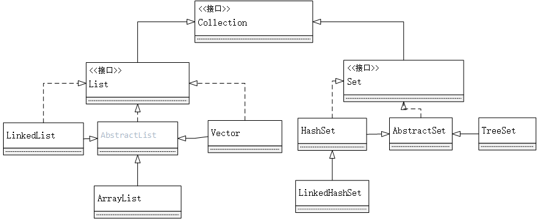
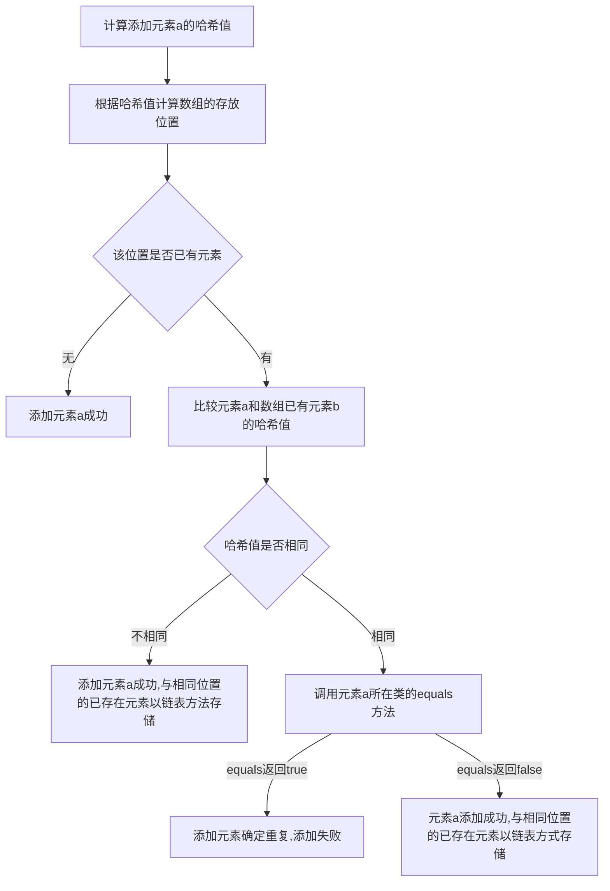
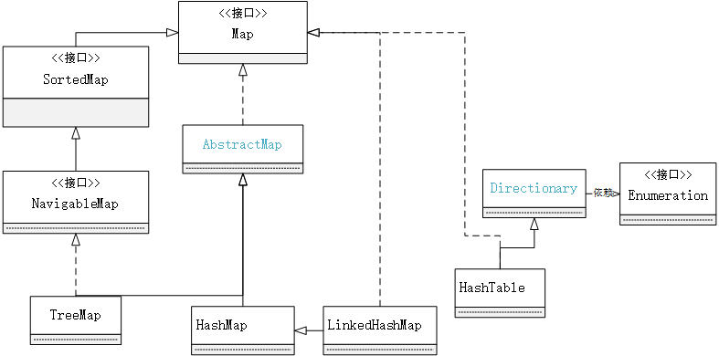
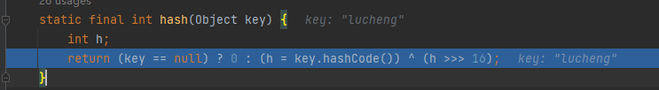
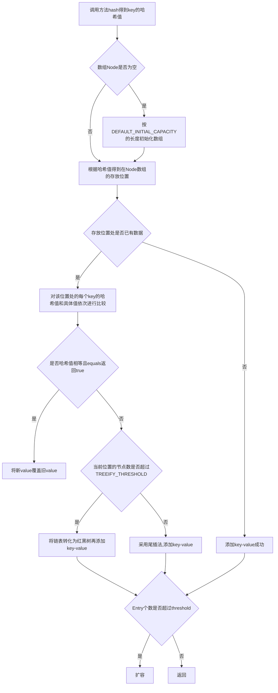

[TOC]

## 集合框架的概述

集合、数组都是对多个数据进行存储操作的结构，简称Java容器。此时的存储主要指的是内存层面的存储，不涉及到物理方面持久化的存储。

## 集合与数组

数组在存储数据的特点：

* 初始化后，数组的长度就以确定
* 要指明数组元素的类型声明，比如String[]  int[]
* 数组没有专门操作数组的API如插入、删除等
* 可以存储有序、可重复的数据

集合在Java中可分为Collection和Map两大体系。

> Collection接口家族关系




1. Collection接口：单列数据，定义了存取一组对象的方法的集合，有两个子接口

   * List:元素**有序、可重复**的集合，可以动态增删元素，常见实现类有：
     * `ArrayList`：底层使用Object[]存储数据
     * `LinkedList`: 底层使用链表进行数据存储
     * `Vector`:一个比较老的List实现类，现在用的比较少了
   * Set：元素**无序、不可重复**的集合,常见实现类有：
     * `HashSet`：底层就是基于`HashMap`，遍历时无序
     * `LinkedHashSet`:底层就是基于`HashSet`,使用双向链表记录数据存储顺序，遍历时有序
     * `TreeSet`：底层使用红黑树存储，可以根据元素指定的排序顺序进行遍历

2. Map接口：双列数据，保存具有映射关系"key-value"对的集合,常见实现类有：

   - `HashMap`
   - `LinkedHashMap`
   - `TreeMap`


## Collection接口中的方法的使用

1. `add(Object e)`:添加集合元素
2. `add(Collection c)`:添加c集合元素到调用集合中
3. `clear()`:清空集合内元素
4. `isEmpty()`:判断集合中元素是否为空

```java
Collection coll = new ArrayList();
coll.add("AA");
coll.add("BB");
coll.add(23);
coll.add(new Date());
System.out.println(coll.size());//4
Collection co2 = new ArrayList();
co2.add("cc");
co2.add("dasdad");
coll.addAll(co2);
System.out.println(coll.size());//6
System.out.println(coll);//[AA, BB, 23, Thu Oct 07 15:01:57 CST 2021, cc, dasdad]
System.out.println(co2.isEmpty());//false
co2.clear();
System.out.println(co2.isEmpty());//true
```

5. `contains(Object obj)`:判断当前集合中是否包含obj，在判断时依次按集合中元素顺序，按对象所在**类的equal()方法进行比较**
6. `containsALL(Collection coll)`:判断形参coll中的所有元素是否都存在于当前集合中，是的话返回true
7. `remove(Object obj)`:删除集合中为obj对象的元素
8. `removeAll(Collection coll)`:删除两个集合中的并集元素，如`{12,35,"AA",false}`.`{12,34}` --> `{35,"AA",false}`
9. `retainAll(Collection coll)`:交集，获取当前集合和coll集合的交集并返回给当前集合，如`{12,35,"AA",false}`.`{12,34}` --> `{12}`
10. `equals(Object obj)`:判断当前集合和形参集合是否相同，相同返回true（List实现类要求元素顺序一致，Set实现类不要求）
11. `toArray()`:将集合转化为数组

```java
Object[] arr = coll.toArray();
for(int i=0;i<arr.length;i++){
	System.out.printIn(arr[i]);
}
```

12. `asList()`:这是一个Arrays类的静态方法，将数组转化为集合

```java
List<String> list = Arrays.asList(new String[]{"AA","BB"});
```

13. `iterator()`:返回Iterator接口的实例，用于遍历集合Collection中的元素

```java
//用迭代器遍历元素
while (iterator.hasNext()){
    System.out.println(iterator.next());
}
```

## Collection子接口一：List接口

* `ArrayList`：作为List接口的主要实现类；线程不安全，效率高，底层使用Object[]存储
* `LinkedList`：底层使用双向链表存储，使用此类效率比`ArrayList`高，所以适合频繁的插入、删除操作
* `Vector`：作为List接口的最早实现类，线程安全的，效率低；底层使用Object[]存储

### List接口常用方法

1. 增 `add(Object obj)`

2. 删 `remove(int index)` 和`remove(Object obj)`

3. 改 `set(int index, Object ele)`

4. 查 `get(int index)`

5. 插 `add(int index,Object ele)`

6. 长度 `size()`

   ```java
   ArrayList list = new ArrayList();
   list.add(123);
   list.add(13);
   list.add("AA");
   list.add(new person(18,"路程"));
   list.add(456);
   System.out.println(list);//[123, 13, AA, person{age=18, name='路程'}, 456]
   
   //void add(int index,Object ele);在index位置插入ele元素
   list.add(1,"88");//在索引处为一的位置插入元素字符串"88"
   System.out.println(list);//[123, 88, 13, AA, person{age=18, name='路程'}, 456]
   
   //boolean addAll(Collection c)
   List list1 = Arrays.asList(1, 2, 3);
   list.addAll(list1);//将list1中的元素加入list中
   list.addAll(4,list1);//从索引为4的位置处开始将list1中的元素添加入list1中
   System.out.println(list);//[123, 88, 13, AA, 1, 2, 3, person{age=18, name='路程'}, 456, 1, 2, 3]
   
   list.add(list1);//将list1整体作为一个元素加入到list中
   System.out.println(list);//[123, 88, 13, AA, 1, 2, 3, person{age=18, name='路程'}, 456, 1, 2, 3, [1, 2, 3]]
   
   System.out.println(list.get(7));//获取指定index位置处的元素 person{age=18, name='路程'}
   
   System.out.println(list.indexOf("AA"));//返会首次出现AA元素的索引处，如果不存在则返回-1
   
   Object o = list.remove(4);//移除指定索引处的元素并返回该元素
   System.out.println(o);//1
   System.out.println(list);//[123, 88, 13, AA, 2, 3, person{age=18, name='路程'}, 456, 1, 2, 3, [1, 2, 3]]
   
   Object o1 = list.set(0, 124);//重新设置指定索引处的元素并返回旧的元素
   System.out.println(o1);//123
   System.out.println(list);//[124, 88, 13, AA, 2, 3, person{age=18, name='路程'}, 456, 1, 2, 3, [1, 2, 3]]
   
   //list sublist(int fromIndex,int toIndex) 返回从fromIndex到toIndex位置的左闭右开区间的子集合
   List subList = list.subList(2, 7);
   System.out.println(subList);//list[2,7) [13, AA, 2, 3, person{age=18, name='路程'}]
   ```

7. 遍历:Iterator迭代器  foreach循环  普通循环

```java
    Collection coll = new ArrayList();
    //add(Object e) 添加元素到集合中
    coll.add("AA");
    coll.add("BB");
    coll.add(23);
    //使用foreach循环进行遍历
    for (Object obj :coll) {
        System.out.println(obj);
    }
	coll.forEach(System.out::printIn);
	//使用Iterator迭代器方式
	Iterator iterator = list.iterator();
	while(iterator.hasnext()){
		System.out.printIn(iterator.next());
    }
```

### ArrayList的底层实现原理

> ArrayList底层使用一个**Object[] elementData**存储数据

#### JDK7和JDK8的不同

初始化elementData数组的时机不同：JDK7之前，在初始化ArrayList时就定义好了**长度为10**的elementData数组；JDK8之前，初始化ArrayList时，elementData数组长度为空，等到有元素插入时才进行初始化具体长度

#### 扩容机制

初始化的elementData数组长度是10，当添加元素后容量超过elementData的数组长度，此时要进行扩容。具体操作为，创建一个容量为原始容量1.5倍的新数组，并把原来数组的元素复制过去，并在最后插入最新的元素。

```java
elementData = Arrays.copyOf(elementData, newCapacity);
```

## Collection子接口二：Set接口

Set接口主要特点是存储**无序的、不可重复的数据**,这主要有三种实现类：

1. `HashSet`:作为Set接口的主要实现类；线程不安全，可以存储null值
2. `LinkedHashSet`:作为`HashSet`的子类：遍历其内部数据时，可以按添加的顺序遍历(通过双向链表的形式实现)
3. `TreeSet`：底层存储的数据结构是**红黑树**，可以按照添加对象的指定属性，**进行自定义排序**

>  Set接口中没有额外定义新的方法，使用的都是Collection中声明过的方法。

Set接口的**无序性不等于随机性**，存储的数据在底层数组中并非按照数组索引的顺序添加，而是根据数据的哈希值决定。不可重复性保证添加的元素按照equals()判断时，不能返回true，即相同的元素只能添加一个。

### HashSet添加元素的过程

`HashSet`底层也是数组，初始容量是16，当使用率超过0.75，就会扩大容量为原来的2倍。

首先向`HashSet`中添加元素a，首先调用元素a所在类的`hashCode()`方法，计算元素a的哈希值，此哈希值可以通过某种算法计算出在`HashSet`底层数组中的存放位置，接下来就是根据哈希值判断数组中是否已有重复元素的过程：



注：向Set中添加的数据其对应的类一定要重写hashCode()和equals()方法;且重写的hashCode()和equals()尽可能保持一致性：相等的对象保证是相同的哈希值。重写两个方法的小技巧：对象中用作equals()方法比较的Field，都应来计算hashcode。

### TreeSet的自然排序

TreeSet中的数据遍历时按数据大小进行排序并遍历输出，所以要求添加的数据都是同一个类的对象；根据不同的数据类型，有自然排序和自定义排序两种情况。其中自定义排序需要在类中声明比较方法（通过实现Comparable接口，判断两个对象是否相同的标准为compareTo()是否返回0，不再是equals()和hashCode()。如果返回0的话代表数据重复，重复的数据不会添加成功)

```java
//自定义排序方法
@Override
public int compareTo(Object o) {
    if(o instanceof person){
        int res = this.name.compareTo(((person) o).name);
        if(res != 0)
            return res;
        else//两个person对象的name相同
        {
            return Integer.compare(this.age,((person) o).age);
        }
    }else{
        throw new RuntimeException("输入数据类型不匹配");
    }
}
```

```c
typedef struct ThreadNode{
    ElemType data;
    struct ThreadNode *lchild,*rchild;   //左右孩子/前驱后读节点指针
    int ltag,rtag; //左、右线索标志
}ThreaedNode,*ThreadTree;
```


## Map接口

> Map接口家族关系



* `HashMap`:作为Map的主要实现类；线程不安全但效率高；**可以存储null的key和value**。

* `LinkedHashMap`：作为HashMap的子类，在HashMap的数据结构基础上增加了一个双向链表，保证在遍历map元素时可以按照添加的顺序实现遍历

* `TreeMap`:保证按照添加的key-val对进行排序，实现排序遍历。此时考虑key的自然排序和定制排序。底层是使用红黑树

* `Hashtable`：作为古老的实现类；线程安全，效率低；**不能存储null的key和value**,底层采用数组和链表进行存储。

* `Properties`：常用来处理配置文件，key和value都是String类型

Map结构中有key-value一对键值作为基本数据元素，其中的key要求是**无序、不可重复**的，使用Set存储所有的Key（Key所在的类要重写hashCode()和equals()）;Map中的value是**无序、可重复**的，使用Collection存储所有的value。一个键值对key-value构成了一个Entry对象。Map中的entry是无序的、不可重复的，使用set存储entry对象。

### Map接口常用方法

1. 添加：`put(Object key,Object value)`

2. 删除：`remove(Object key)`

3. 修改：`put(Object key,Object value)`

   ```java
   Map map = new HashMap();
   map.put("AA",11);//put方法：将指定的一对key-value添加到Map对象中
   map.put("bb",22);
   map.put("BB",33);
   map.put("CC",11);
   System.out.println(map);//{AA=23, bb=22, BB=33, CC=11}
   map.put("AA",23);//key已在map中存放，由于key值不可重复，所以会把新value值覆盖老value值
   System.out.println(map);//{AA=23, bb=22, BB=33, CC=11}
   Map map1 = new HashMap();
   map1.put("DD",14);
   map1.put("BB",23);
   map.putAll(map1);
   System.out.println(map);//{AA=23, bb=22, BB=23, CC=11, DD=14}
   Object o = map.remove("AA");//移除指定key的键值对，并返回对应key的value值
   System.out.println(map);//{bb=22, BB=23, CC=11, DD=14}
   map.clear();//清空map中的所有数据
   System.out.println(map);//{}
   ```

4. 查询：`get(Object key)`

5. 长度:`size()`

   ```java
   Map map = new HashMap();
   map.put("AA",11);
   map.put("bb",22);
   map.put("BB",33);
   map.put("CC",11);
   Object o1 = map.get("AA");//获取指定key对应的value
   System.out.println(o1);
   boolean isKeyExist = map.containsKey("BB");//判断是否包含指定的key
   System.out.println(isKeyExist);
   boolean isValueExist = map.containsValue(222);//判断是否包含指定的value
   System.out.println(isValueExist);
   System.out.println(map.size());//返回map对象的key-value对数
   ```

6. 遍历：`keySet()`:遍历key集 `values()`:遍历value集 `entrySet()`:遍历entry集

   ```java
   Map map = new HashMap();
   map.put("AA",11);
   map.put("bb",22);
   map.put("BB",33);
   map.put("CC",11);
   
   //遍历所有的key集
   Set set = map.keySet();
   Iterator iterator = set.iterator();
   while (iterator.hasNext()){
       System.out.println(iterator.next());
   }
   
   //遍历所有的value集
   Collection values = map.values();
   for (Object obj :values) {
       System.out.println(obj);
   }
   
   //遍历所有的key-value键值对
   Set entrySet = map.entrySet();
   Iterator iterator1 = entrySet.iterator();
   while (iterator1.hasNext()){
       Object o = iterator1.next();
       Map.Entry entry = (Map.Entry) o;//将o强行转化为Entry类型
       System.out.println(entry.getKey()+"------>"+entry.getValue());
   }
   ```

### TreeMap

>可以按照key-value的属性进行大小排序，并以该顺序进行遍历输出。底层是使用红黑树的数据结构

```java
//TreeMap中由于是按健值顺序遍历，所有数据必须是同一个类
//有基本数据类型的自然排序和自定义排序。通过实现compare方法，进行排序和去重（代替equals和hashCode方法）
//自然排序
@Test
public void TreeMapTest1(){
    TreeMap treeMap = new TreeMap();
    treeMap.put("AA",13);
    treeMap.put("AB",12);
    treeMap.put("BB",12);
    treeMap.put("CC",12);
    treeMap.put("Cd",12);
    treeMap.put("AA",23);
    //treeMap.put(1,123); 由于key类型是Integer不能与String类型比较，所以添加入后会报错
    System.out.println(treeMap);
}

//自定义排序
@Test
public void TreeMapTest2(){
    TreeMap treeMap = new TreeMap(new Comparator() {
        @Override
        public int compare(Object o1, Object o2) {
            if(o1 instanceof person && o2 instanceof person){
                person p1 = (person) o1;
                person p2 = (person) o2;
                return  -p1.getName().compareTo(p2.getName());
            }
            throw new RuntimeException("输入数据类型不匹配");
        }
    });

    treeMap.put(new person(18,"lucheng"),15);
    treeMap.put(new person(18,"lucheng"),16);
    treeMap.put(new person(18,"lucy"),16);
    treeMap.put(new person(18,"lucas"),15);

    Set set = treeMap.keySet();
    Iterator iterator = set.iterator();
    while (iterator.hasNext()){
        System.out.println(iterator.next());
    }
}
```

### HashMap的底层实现原理

#### JDK7和JDK8的不同

HashMap的底层操作在jdk7和jdk8之间有所不同，几个重要的改变就是

1. HashMap的底层存储结构在jdk7及之前采用**数组+单链表**的形式；在jdk8及之后会**根据情况调整成数组+红黑树**的形式进行存储；
2. HashMap在实例化时的操作:`HashMap map = new HashMap()`时.在jdk7及之前，实例化的同时就创建好一个长度是16的数组Entry[] table;而在jdk8及之后，延迟到需要添加元素时才进行创建
3. 在插入元素时，哈希值得到的数组位置已有元素但都不相同的情况下，在jdk7及之前，采用**头插法**的方式插入链表头部；在jdk8及之后，采用**尾插法**的方式插入链表尾部。
4. key-value键值对封装的数据类型不同。JDK7及之前，key-value采用的是Entry类进行封装；JDK8及之后，key-value采用的是Node类进行封装

#### `map.put(key1,value1)`在执行时的底层实现过程

首先给出HashMap类中几个关键属性的含义。

* DEFAULT_INITIAL_CAPACITY = 1 << 4;   默认的初始容量16
* MAXIMUM_CAPACITY =  1 << 30;   数组的最大容量
* DEFAULT_LOAD_FACTOR = 0.75f;   默认加载因子
* TREEIFY_THRESHOLD = 8;  默认树化阈值8，当链表的长度达到这个值后，要考虑树化
* UNTREEIFY_THRESHOLD = 6;  默认反树化阈值6，当树中节点的个数达到此阈值后，要考虑退化成链表
* MIN_TREEIFY_CAPACITY = 64; 最小树化的容量64。当单个链表的节点个数达到8且table数组的长度达到64才会树化；当单个链表的节点个数达到8，但是table的长度未达到64，会先扩容
* transient Node<K,V>[] table;  存放键值对的数组，相当于entry数组
* transient int  size； 记录有效映射关系的对数，也是Entry对象的个数
* int threshold    阈值，当size达到阈值时，考虑扩容(阈值 = 数组容量*加载因子)
* float  loadFactor   加载因子，影响扩容频率 

以`HashMap<String,Interger> map = new HashMap<>();map.put("lucheng",123)`为例：

1. 实例化map对象。创建一个空的hashmap，并定义初始容量为16，加载因子为0.75

   ```java
   public HashMap() {
       this.loadFactor = DEFAULT_LOAD_FACTOR; // all other fields defaulted
   }
   ```
2. 将key:lucheng进行哈希计算得到一个哈希值
	

3. 当前map的数组为空，使用resize()方法进行初始化Node数组,初始化长度为DEFAULT_INITIAL_CAPACITY

   ```java
   newCap = DEFAULT_INITIAL_CAPACITY;
   newThr = (int)(DEFAULT_LOAD_FACTOR * DEFAULT_INITIAL_CAPACITY);
   Node<K,V>[] newTab = (Node<K,V>[])new Node[newCap];
   table = newTab;
   ```

4. 根据哈希值对数组长度取模得到索引位置，并判断索引值对应位置为空,创建一个新节点,并写入该数组位置上

   ```java
   if ((p = tab[i = (n - 1) & hash]) == null)
               tab[i] = newNode(hash, key, value, null);
   ```

5. Entry对象的个数加1，然后返回

   ```java
           if (++size > threshold)
               resize();
   		return null;
   ```

一个基本的HashMap中插入元素(key,value)的流程如下：




>  负载因子值的大小对HashMap的影响？

> 答：负载因子值是关于HashMap容量扩充机制的阈值。当HashMap的当前容量>负载因子*初始容量时，就会触发HashMap扩容机制。所以负载因子的大小影响扩充容量的临界阈值。当负载因子比较小时，扩充容量的临界值较小，很容易就触发，造成HashMap容量增加，哈希冲突的几率降低，但以增加了空间容量为代价；当负载因子较大时，扩充容量一般就是在当前容量已接近初始容量时扩容，此时哈希冲突频繁，相同位置上的链表很长，虽空间没有增加，但查询效率降低。为平衡时间和空间，Java中的HashMap的默认负载因子是0.75.

####  HashMap的扩容机制是什么

当 HashMap 中的元素数量达到了负载因子(load factor) * 容量(capacity)时，就会触发扩容操作，将容量增加为原来的**两倍**（为什么是两倍）。

在扩容过程中，HashMap 首先会创建一个新的数组，长度为原来的两倍，并将原来数组中的元素重新分配到新的数组中。具体地，它会遍历原来数组中的每个桶(Node)，将其中所有的键值对重新计算 hashcode 后分配到新的数组中。

在重新分配时，如果新数组中的某个位置已经存在元素，则采用链表或红黑树的方式进行处理，将新元素插入到该位置对应的链表或红黑树中。这样可以避免出现哈希冲突的情况。

扩容操作完成后，HashMap 中的元素数量会保持不变，但容量会增加为原来的两倍。这种扩容机制能够有效地减少哈希冲突的概率，提高 HashMap 的性能。

### LinkedHashMap的底层实现原理

> LinkedHashMap在基于HashMap的数据结构基础上，添加了一个双向链表，用于记录添加的顺序。
>
> ```java
> public class LinkedHashMap<K,V>
>     extends HashMap<K,V>
>     implements Map<K,V>{
> }
> ```

`LinkedHashMap`重写了HashMap的newNode方法。

```java
    Node<K,V> newNode(int hash, K key, V value, Node<K,V> e) {
        LinkedHashMap.Entry<K,V> p =
            new LinkedHashMap.Entry<K,V>(hash, key, value, e);
        linkNodeLast(p);
        return p;
    }
```

底层数据结构变化：使用Entry<K,V>继承了Node<K,V>,然后添加了前后指针

```java
static class Entry<K,V> extends HashMap.Node<K,V> {
    Entry<K,V> before, after;
    Entry(int hash, K key, V value, Node<K,V> next) {
        super(hash, key, value, next);
    }
}
```

## Collections工具类

>  Collections是一个操作Set、List和Map等集合的工具类。
>
> Collections中提供了一系列静态的方法对集合元素进行排序、查询和修改等操作，还提供了对集合对象设置不可变、对集合对象实现同步控制等方法。Collection工具类中都是static方法。

常用方法：

1. `reverse(List)`:反转List中元素的顺序
2. `shuffle(List)`:对List进行随机排序
3. `sort(List)`:根据元素的自然顺序对指定List集合元素按升序排序
4. `sort(List,Comparator)`:根据指定的Comparator产生的顺序对List集合的元素进行排序
5. `swap(List,int i,int j)`:将指定List集合中的i处元素和j处元素进行替换
6. `Object max(Collection)`：根据元素的自然顺序，返回给定集合中的最大元素
7. `Object max(Collection,Comparator)`:根据Comparator指定的顺序，返回给定集合的最大元素
8. `int frequency(Collection ,Object)`:返回指定集合中指定集合的出现次数

