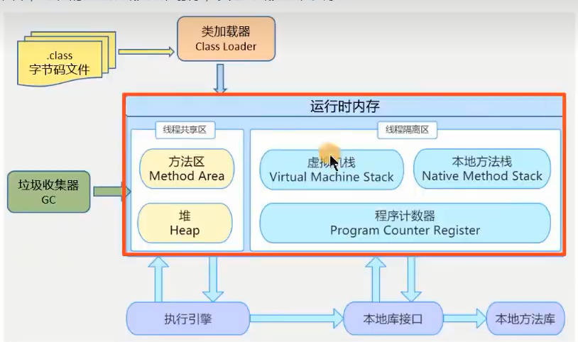
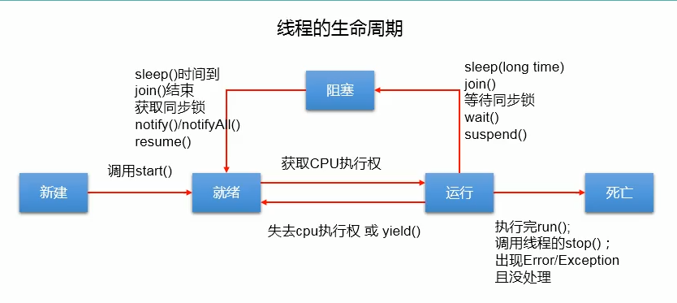
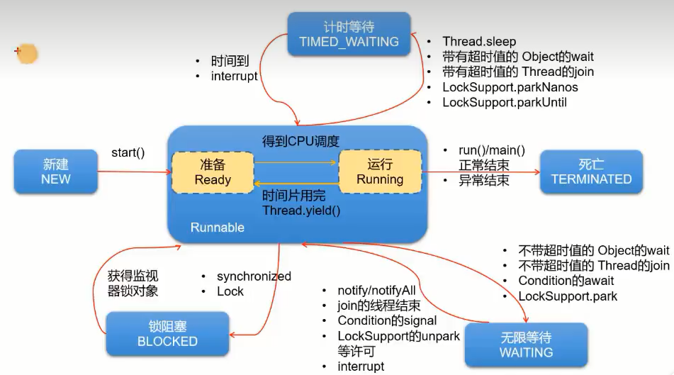

[TOC]

## 程序、进程、线程

1. 程序：为完成特定任务、用某种语言编写的一组指令的集合，即指一段静态的代码。

2. 进程：是程序的一次执行过程，或是正在运行的一个程序。**是一个动态的过程**：有它自身的产生、存在和消亡的过程。

   - 程序是静态的，进程是动态的
   - 进程作为**操作系统资源调度分配的最小单位**，系统在运行时会为每个进程分配不同的内存区域

3. 线程：进程可进一步细化为线程，是一个程序内部的一条执行路径。

   - 若一个线程在同一时间可**并行**多个线程，那就是支持多线程的。（比如在QQ电脑管家中，病毒扫描是一个线程，垃圾清理是一个线程，这两个线程可以同时运行）
   
   - **线程作为CPU调度和执行的最小单位，每个线程拥有独立的运行栈和程序计数器**。线程切换的开销小。（一个JAVA应用程序java.exe，至少有三个线程：main()主线程,垃圾回收线程，异常）

   - 一个进程中的多个线程共享相同的内存单元/内存地址空间--->他们从同一堆中分配对象，可以**共享堆和方法区的变量和对象**，**但不同线程的栈是独立的**，一个线程对应一个栈。从而使得线程间通信更简便、高效。多线程可以提高程序的运行效率，但由于多个线程操作共享的系统资源，如果使用不当，会带来安全隐患(多线程对共享变量的操作导致的安全问题)。
   
     
   
   ​												JVM内存区域
   
4. 单核CPU和多核CPU

   单核CPU就是一个CPU处理进程。CPU以一个时间单位为基准，然后按照时间片调度为算法，在不同的时间片上处理不同的进程任务。由于时间单位时间很短，所以人们在使用上感觉不出来是异步的，认为是同时的。

   多核CPU的话就是多个线程可以在不同的CPU上运行，就更好的发挥了多线程的效率。
   
## 多线程的创建

   方式一：

   1. 创建于一个继承于thread类的子类
   2. 重写thread类中的run方法
   3. 创建thread类的子类对象
   4. 通过此对象调用start()开启线程

   注：线程对象.start()方法，对于同一个线程对象来说只能调一次。start()方法的任务就是开辟一个线程的栈空间，开辟结束后就会自动释放，调用多次线程方法需用多个对象即

   `线程对象1.start()` `线程对象2.start()`

```java
public class CreateThread1 {
    public static void main(String[] args) {
        myThread myThread = new myThread();
        //myThread.run();//使用run仍然是单线程
        myThread.start();//使用start开启线程而不是使用run开启
        for (int i = 0; i < 1000; i++) {
            System.out.println("主线程:"+i);
        }
    }
}
class myThread extends Thread{
    @Override
    public void run() {
        for (int i = 0; i < 1000; i++) {
            System.out.println("分线程："+i);
        }
    }
}
```

   方式二：

1. 创建一个实现了Runnable接口的类
2. 实现类去实现Runnable中的抽象方法：run()
3. 创建此实现类的对象
4. 将此对象作为参数传递到Thread类的构造器中，创建Thread类的对象
5. 通过Thread类的对象调用start()

```java
public static void main(String[] args) {
		myThread thread = new myThread();
    	Thread thread = new Thread(new Runnable({
              @Override
   			 public void run(){
       		 //线程方法
    		}  
        }));
    	thread.start();//启动线程
  }
```


两种方式的比较：

方式二创建实现Runnable接口的类的方式相比于方式一没有单继承性的局限性且更适合用于处理多个线程有共享资源的情况，

## Thread中的常用方法

1. `start()`:启动当前线程；调用线程中的run()方法

2. `run()`：重写该方法以设置该线程中的功能

3. `currentThread()`:静态方法，返回执行当前代码的线程对象

4. `getName()`:获取当前进程的名字

5. `setName()`:设置当前进程的名字

5. `getId()`:获取线程的id

6. `yield()`:释放CPU的使用权

7. `join()`:在线程a中调用线程b的join方法，此时**线程a就进入阻塞状态**，去执行线程b，直到线程b完全执行完之后，才回到线程a

8. `sleep(long milltime)`：让当前线程睡眠指定的milltime毫秒。是一个静态方法，在指定的milltime毫秒时间内，**当前线程**是阻塞状态

   ```java
   public class ThreadDemo3 {
       public static void main(String[] args) throws InterruptedException {
           Thread myThread3 = new myThread3();
           myThread3.setName("线程三");
           myThread3.start();
           Thread.sleep(1000*5);//由于sleep是静态方法，所以实际调用对象是main线程，进入睡眠状态的是main线程
           System.out.println("你好这是main线程!");
       }
   }
   
   class myThread3 extends Thread{
       @Override
       public void run() {
           for (int i = 0; i < 150; i++) {
               System.out.println(i);
           }
       }
   }
   ```

9. `isAlive()`:判断当前线程是否存活（如果已执行完run方法则代表不存活）

10. `interrupt()`:调用该方法，让当前进程触发`InterruptedException`

```java
public class ThreadDemo4 {
    public static void main(String[] args) {
        myThread4 myThread4 = new myThread4();
        Thread thread = new Thread(myThread4);
        thread.setName("线程一");
        thread.start();
        thread.interrupt();//中断线程thread，并触发thread中的异常
    }
}

class myThread4 implements Runnable {

    @Override
    public void run() {

        try {
            Thread.sleep(1000*5);
        } catch (InterruptedException e) {
            e.printStackTrace();
        }
        System.out.println("当前线程名称:"+Thread.currentThread().getName());
    }
}
```

## 线程的调度

Java的线程调度策略是同优先级线程组成先进先出队列（先到先服务），使用时间片策略；对高优先级，使用优先调度的抢占式策略。

1. 线程的优先级：`MAX_PRIORITY：10`

   ​						   `MIN_PRIORITY:1`

   ​						  `NORM_PRIORITY:5` 默认的优先级

2. `getPriority()`:获取线程的优先级

   `setPriority`:设置线程

   注：高优先级的线程要抢占低优先级进程CPU的执行权。但是从概率上讲，高优先级的线程高概率的情况下被执行，并不意味着只有当高优先级的线程执行完之后，低优先级的线程才执行。

## 线程的生命周期

和人有有限的生命一样，线程也有生命周期。人在不同时间、不同环境下有不同的状态，线程也在生命周期有不同的状态。

JDK中用Thread.State类定义了线程的几种状态:创建、就绪、运行、阻塞、终止。

Java的线程生命周期图(JDK1.5之前)



JDK1.5之后,将就行和运行合并为Runnable；阻塞状态细分为3种类型：`BLOCKED` `TIMED_WAITING` `WAITING`

```JAVA
public enum State {
    /**
     * Thread state for a thread which has not yet started.
     */
    NEW,

    /**
     * Thread state for a runnable thread.  A thread in the runnable
     * state is executing in the Java virtual machine but it may
     * be waiting for other resources from the operating system
     * such as processor.
     */
    RUNNABLE,

    /**
     * Thread state for a thread blocked waiting for a monitor lock.
     * A thread in the blocked state is waiting for a monitor lock
     * to enter a synchronized block/method or
     * reenter a synchronized block/method after calling
     * {@link Object#wait() Object.wait}.
     */
    BLOCKED,

    /**
     * Thread state for a waiting thread.
     * A thread is in the waiting state due to calling one of the
     * following methods:
     * <ul>
     *   <li>{@link Object#wait() Object.wait} with no timeout</li>
     *   <li>{@link #join() Thread.join} with no timeout</li>
     *   <li>{@link LockSupport#park() LockSupport.park}</li>
     * </ul>
     *
     * <p>A thread in the waiting state is waiting for another thread to
     * perform a particular action.
     *
     * For example, a thread that has called <tt>Object.wait()</tt>
     * on an object is waiting for another thread to call
     * <tt>Object.notify()</tt> or <tt>Object.notifyAll()</tt> on
     * that object. A thread that has called <tt>Thread.join()</tt>
     * is waiting for a specified thread to terminate.
     */
    WAITING,

    /**
     * Thread state for a waiting thread with a specified waiting time.
     * A thread is in the timed waiting state due to calling one of
     * the following methods with a specified positive waiting time:
     * <ul>
     *   <li>{@link #sleep Thread.sleep}</li>
     *   <li>{@link Object#wait(long) Object.wait} with timeout</li>
     *   <li>{@link #join(long) Thread.join} with timeout</li>
     *   <li>{@link LockSupport#parkNanos LockSupport.parkNanos}</li>
     *   <li>{@link LockSupport#parkUntil LockSupport.parkUntil}</li>
     * </ul>
     */
    TIMED_WAITING,

    /**
     * Thread state for a terminated thread.
     * The thread has completed execution.
     */
    TERMINATED;
}
```



## 线程同步

作用：使得不同进程在对共享资源访问时不被干扰切换至其他线程从而导致错误的发生。
### synchronized
#### 方式一同步代码块

如果同步方法是需要执行一个很长时间的任务，那么多线程在排队处理同步方法时就会等待很久，但是一个方法中，其实并不是所有的代码都需要同步处理的，只有可能会发生线程不安全的代码才需要同步。这时，可以采用`synchronized`来修饰语句块让关键的代码进行同步。

```java
synchronized(同步监视器){
    //需要被同步的代码块
}
```

同步监视器，俗称锁。任何一个类的对象，都能充当锁。但是要保证多个线程是共用同一把🔒，否则每个线程都自己有个锁的话无法实现同步效果。由于同步过程中，只能有一个线程在CPU上执行，所以对于单个CPU来说在执行同步代码块时，是单线程工作的。

下面是一个售卖车票的案例：

```java
public class sellTicketDemo {
    @Test
    public void testSellTickets() throws InterruptedException {
        sellTicketService sellTicketService = new sellTicketService();
        window window = new window(sellTicketService);
        Thread window1 = new Thread(window);
        window1.setName("窗口一");
        Thread window2 = new Thread(window);
        window2.setName("窗口二");
        Thread window3 = new Thread(window);
        window3.setName("窗口三");//三个窗口线程
        window1.start();window2.start();window3.start();
        Thread.sleep(1000*20);
    }
}
class window implements Runnable{
    private sellTicketService service;
    public window(sellTicketService service) {
        this.service = service;
    }
    @Override
    public void run() {
        service.sellTicket();
    }
}
/**
 * 将售票服务单独作为一个类
 */
class sellTicketService{
    private int tickets = 100;//初始票数量
    public void sellTicket(){
        while (true){
            synchronized (this){//this表示调用该类的对象
                if(tickets == 0){
                    System.out.println("票已售磬!");
                    break;
                }
                try {
                    Thread.sleep(100);
                    System.out.println(Thread.currentThread().getName()+":卖出票，票号为："+ (100-tickets));
                    tickets--;
                } catch (InterruptedException e) {
                    e.printStackTrace();
                }
            }
        }
    }
}
```

#### 方式二：同步方法

如果操作共享数据的代码在一个方法中，可以将这个方法设置为同步的。

#### 类锁

类锁，就是对于同一个类中的**静态方法使用synchronized修饰**后，该方法就是用类加锁的方法，因为静态方法是随着类加载而加载的，所以synchronized修饰的静态方法和非静态方法不同之处在于：静态方法由类加锁，只要不同线程使用该类进行调用就是同步状态；而非静态方法是对锁，针对的是同一对象呈现非同步状态。


#### 处理Runnable的线程安全问题

将处理共享资源的方法用`synchronized`修饰，即用默认同步监视器中的this是当前类的对象。

```java
private  synchronized void sell(){//默认同步监视器：this
    if(ticket>0){
        try {
            Thread.sleep(100);
        } catch (InterruptedException e) {
            System.out.println(e.getMessage());
        }
        System.out.println(Thread.currentThread().getName()+"卖出车票:"+ticket);
        ticket--;
    }
}
```

#### 处理继承Thread类的线程安全问题

```java
private static synchronized void sell(){//由于是静态，同步监视器指代的是当前的类
//private  void sell{ 错误的写法  不同的进程是不同的对象,而this指代的是当前对象
    if(ticket>0){
        try {
            Thread.sleep(100);
        } catch (InterruptedException e) {
            System.out.println(e.getMessage());
        }
        System.out.println(Thread.currentThread().getName()+"卖出车票:"+ticket);
        ticket--;
    }
}
```

总结：

1. 同步方法仍然涉及到同步监视器，只是不需要我们显式的声明。
2. 非静态的同步方法，同步监视器是：this 当前对象
3. 静态的同步方法，同步监视器是：当前类本身
4. 在继承Thread类的线程同步中，慎用this充当同步监控器，考虑使用当前类充当同步监控器

### lock

1. 实例化一个ReentrantLock对象
2. 在进入同步代码块前调用锁定方法：`lock()`
3. 在同步代码块结束之后调用解锁方法:`unlock()`

```java
class Window implements Runnable{
    private int tickets = 100;
    //1. 实例化一个ReentrantLock对象
    private ReentrantLock lock = new ReentrantLock(true);//空参默认是false
    @Override
    public void run() {
        while(true){
            try{
                //2. 调用锁定方法：lock()
                lock.lock();
                if(tickets > 0){
                    System.out.println(Thread.currentThread().getName()+"卖出车票："+ tickets);
                    tickets--;
                }
                else
                    break;
            }finally {
                //3. 调用解锁方法：unlock()
                lock.unlock();
            }

        }
    }
}
```

### synchronized和lock的区别

1. synchronized机制在执行完相应的同步代码后，自动释放同步监视器
2. lock需要手动的启动锁定`lock()`和解锁`unlock()`
3. Lock只有代码块锁，synchronized有代码块锁和方法锁

### 保证可见性的关键字——volatile

在多线程争抢对象的时候，处理该对象的变量的方式是在主内存中读取该变量的值到线程私有的内存中，然后对该变量做处理，处理后将值在写入到主内存中。上面举的例子，之所以出现结果与预期不一致都是因为线程自己将值复制到自己的私有栈后修改结果而不知道其他线程的修改结果。如果我们不用同步的话，我们就需要一个能保持可见的，知道其他线程修改结果的方法。JDK提供了`volatile`关键字，来保持可见性，关键字volatile的作用是强制从公共堆栈中取得变量的值，而不是从线程私有数据栈中取得变量值。但是该关键字并不能保证原子性，以争抢一个对象中的count变量来看下图的具体说明：

> java 垃圾回收整理一文中，描述了jvm运行时刻内存的分配。其中有一个内存区域是jvm虚拟机栈，每一个线程运行时都有一个线程栈，线程栈保存了线程运行时候变量值信息。当线程访问某一个对象时候值的时候，首先通过对象的引用找到对应在堆内存的变量的值，然后把堆内存变量的具体值load到线程本地内存中，建立一个变量副本，之后线程就不再和对象在堆内存变量值有任何关系，而是直接修改副本变量的值，在修改完之后的某一个时刻（线程退出之前），自动把线程变量副本的值回写到对象在堆中变量。这样在堆中的对象的值就产生变化了。

volatile在此过程中的具体说明如下：
>read and load 从主存复制变量到当前工作内存
>use and assign  执行代码，改变共享变量值
>store and write 用工作内存数据刷新主存相关内容
>其中use and assign 可以多次出现
>但是这一些操作并不是原子性，也就是 在read load之后，如果主内存count变量发生修改之后，线程工作内存中的值由于已经加载，不会产生对应的变化，所以计算出来的结果会和预期不一样对于volatile修饰的变量，jvm虚拟机只是保证从主内存加载到线程工作内存的值是最新的例如假如线程1，线程2 在进行read,load 操作中，发现主内存中count的值都是5，那么都会加载这个最新的值在线程1堆count进行修改之后，会write到主内存中，主内存中的count变量就会变为6线程2由于已经进行read,load操作，在进行运算之后，也会更新主内存count的变量值为6导致两个线程及时用volatile关键字修改之后，还是会存在并发的情况。

上述对于volatile的解析均摘自[java中volatile关键字的含义](http://www.cnblogs.com/aigongsi/archive/2012/04/01/2429166.html)

## 线程安全模式的单例模式

```java
/*
使用同步机制将单例模式中的懒汉模式改为线程安全的
 */
public class BankTest {
}
//懒汉式单例模式
class Bank{
    private Bank(){};
    private static Bank instance = null;

    //在多线程的情况下，会有多个线程调用getInstance方法，其中instance是共享资源
    public static synchronized Bank getInstance(){
       if(instance == null)
           instance = new Bank();
        return instance;
    }
}
```

```java
//方式一 将getInstance加上synchronized关键字
   public static synchronized Bank getInstance(){
      if(instance == null)
            instance = new Bank();
       return instance;
    }
```
```java
// 方式二  将待同步的代码加synchronized包住
//缺点：效率较低  因为每个线程在判断instance是否为空需要创建实例时其它进程都要等待
    public static  Bank getInstance(){
        synchronized (Bank.class) {
            if(instance == null)
                instance = new Bank();
            return instance;
        }
    }
```
```java
//方式三 改良方式二，将线程判断是非空然后取出实例这种情况快一点，将它从同步块中移除；这样的话可以避免单例非空时线程仍然等待的情况
public static  Bank getInstance(){
    if(instance != null ) return instance;
    synchronized (Bank.class) {
        if(instance == null)
            instance = new Bank();
        return instance;
    }
}
```


## 线程的死锁

> 不同的线程分别占用对方需要的同步资源不放弃，都在等待对方放弃自己需要的同步资源，就形成了线程的死锁。
>
> 出现死锁后，不会出现异常和提示，只是所有的线程都处于阻塞方法，无法继续

## 线程通信

> 通过线程之间的通信，可以让不同的线程之间协作完成一个任务。

`wait()`:执行此方法，就将当前进程变成阻塞状态，并**释放同步监视器**，直到等到notify的通知

`nofity()`:唤醒一个被wait的线程，如果有多个线程被wait，则唤醒优先级最高的那一个。如果优先级相同，则随机唤醒一个

`nofityAll()`:唤醒所有被wait的线程

注：

1. wait notify notifyAll三个方法必须在**同步方法或同步代码块中调用**
2. wait notify notifyAll的调用对象必须是**同步方法或同步代码块中的同步监视器**，如果不同会出现`illegalMonitorStateException`异常
3. wait notify notifyAll 三个方法是定义在Object类中
4. wait()和sleep()的不同：
   1. 方法声明位置不同：Thread类中声明了sleep()，Object类中声明了wait()
   2. 调用要求不同：sleep()可以在任何场景下调用，而wait()只能在同步方法或同步代码块中调用
   3. 如果两个方法都在同步监视器中，**wait()会在阻塞线程后可以被通知唤醒并释放锁，而sleep()在阻塞不会释放锁**。

根据阻塞方式的不同，可以将阻塞细分为3种：

* 等待阻塞：运行的线程执行wait方法，JVM会把该线程放入等待队列中；
* 同步阻塞：运行的线程在获取对象的同步锁时，若该同步锁被别的线程占用，则JVM会把该线程放入锁池当中。
* 其他阻塞： 运行的线程执行了`Thread.sleep`或者`join`方法，或者发出I/O请求时，JVM会把该线程置为阻塞状态。当`sleep()`状态超时、`join()`等待线程终止，或者超时、或者I/O处理完毕时，线程重新转入可运行状态。

### 案例1 线程交替打印

```java
/**
 * 使用两个线程打印1-100。线程1和线程2交替打印
 */
public class PrintNumberInTurn {
    public static void main(String[] args) {
        PrintNumber2 printNumber = new PrintNumber2();
        Thread thread1 = new Thread(printNumber, "线程一");
        Thread thread2 = new Thread(printNumber, "线程二");
        thread1.start();thread2.start();
    }
}

/**
 * 实现形式1：线程一和线程二交替打印，但是如果使用wait()空参方法的话，线程会一直阻塞在那;使用wait(long timeout)指定有限等待时间解决
 */
class PrintNumber1 implements Runnable{
    private int number = 1;

    @Override
    public void run() {
        while(true){
            if(number <= 100) {
                synchronized (this) {
                    notify();
                    try {
                        Thread.sleep(50);
                    } catch (InterruptedException e) {
                        throw new RuntimeException(e);
                    }
                    System.out.println(Thread.currentThread().getName() + "打印:" + number);
                    number++;
                    try {
//                        wait(500);  线程如果没有被notify唤醒的话，500ms后自动唤醒
                        wait();
                    } catch (InterruptedException e) {
                        throw new RuntimeException(e);
                    }
                }
            }else {
                break;
            }
        }
    }
}

/**
 * 实现形式2：线程一和线程二交替打印，在if和else两个判断条件中都加上notify，保证再最后一个数打印后，另一个wait的线程能及时被唤醒
 */
class PrintNumber2 implements Runnable{
    private int number = 1;

    @Override
    public void run() {
        while(true){
            synchronized (this) {
                if(number <= 100) {
                    notify();
                    try {
                        Thread.sleep(50);
                    } catch (InterruptedException e) {
                        throw new RuntimeException(e);
                    }
                    System.out.println(Thread.currentThread().getName() + "打印:" + number);
                    number++;
                    try {
                        wait();
                    } catch (InterruptedException e) {
                        throw new RuntimeException(e);
                    }
                }else {
                    notify();
                    break;
                }
            }
        }
    }
}
```

### 案例2 消费者生产者

>```
>生产者消费者问题：
>生产者将产品交给店员(Clerk),而消费者(Consumer)从店员处取走产品，店员一次只能持有固定数量的产品（20个）。
>如果生产者试图生成更多的产品，店员会叫生产者停一下，如果店中有空位放产品了再通知生产者继续生产；
> 如果店中没有产品了，店员会告诉消费者等一下，如果店中有产品了再通知消费者来取走产品
>```

```java
public class ProducerConsumer {
    public static void main(String[] args) {
        Shop shop = new Shop();
        Producer producer = new Producer(shop);
        Consumer consumer1 = new Consumer(shop);
        Consumer consumer2 = new Consumer(shop);
        Thread thread1 = new Thread(producer, "生产者");
        Thread thread2 = new Thread(consumer1, "消费者1");
        Thread thread3 = new Thread(consumer2, "消费者2");
        thread1.start();thread2.start();thread3.start();
    }
}

class Shop{
    private int products = 0;


    /**
     * 生产者生产产品
     */
    public synchronized int produce(){
        if(products >= 20){
            System.out.println("当前产品数量已达到最大存储容量,无法生产!");
            notify();//唤醒消费者线程
            try {
                wait();
            } catch (InterruptedException e) {
                throw new RuntimeException(e);
            }
        }else{
            try {
                Thread.sleep(500);
            } catch (InterruptedException e) {
                throw new RuntimeException(e);
            }
            products++;
            System.out.println(Thread.currentThread().getName()+"生产了一个产品。当前产品数量为:"+products);
        }
        return products;
    }

    /**
     * 消费者消费产品
     * @param counts
     * @return 0:表示当前产品数量不足以消费者消费  其他值：消费产品的数量
     */
    public synchronized int consume(int counts){
        if(products-counts < 0){
            System.out.println(Thread.currentThread().getName()+"消费"+counts+"件商品,库存不足,无法消费");
            notify();//唤醒生产者线程
            try {
                wait();
            } catch (InterruptedException e) {
                throw new RuntimeException(e);
            }
            return 0;
        }else{
            try {
                Thread.sleep(1000);
            } catch (InterruptedException e) {
                throw new RuntimeException(e);
            }
            products -= counts;
            System.out.println(Thread.currentThread().getName()+"消费"+counts+"件商品,剩余库存数量："+products);
            return counts;
        }
    }
}

/**
 * 生产者进程
 */
class Producer implements Runnable{
    private Shop shop;

    public Producer(Shop shop) {
        this.shop = shop;
    }

    @Override
    public void run() {
        while (true){
            shop.produce();
        }
    }
}

/**
 * 消费者进程
 */
class Consumer implements Runnable{
    private Shop shop;

    public Consumer(Shop shop) {
        this.shop = shop;
    }

    @Override
    public void run() {
        while (true){
            Random random = new Random();
            int counts = random.nextInt(10) +1;//获得[1,10]的随机数
            shop.consume(counts);
        }
    }
}
```

## 新增线程创建方式

### 一、实现Callable接口

与使用Runnable相比，Callable功能更强大些。

- 相比run()方法，可以**有返回值**
- 方法可以抛出异常
- 支持泛型的返回值
- 需要借助FutureTask类，比如获取返回结果

#### 步骤

1.创建实现Callable接口的实现类，重写call方法，将线程需执行的操作方法写在call方法中
 ```java
   class numThread implements Callable{
       @Override
       public Object call() throws Exception {
       }
   }
 ```

2. 创建一个实现类的对象

```java
numThread num = new numThread();
```

3. 创建futureTask类的对象，并将实现类对象作为构造器参数

```java
FutureTask futureTask = new FutureTask(num);
```

4. 创建一个Thread类对象，并用futureTask类对象作为参数然后调用start方法

```java
new Thread(futureTask).start();//开启线程
```

5. （可选）get()返回值即为FutureTask构造器参数Callable实现类重写的call方法的返回值

```java
Object result = futureTask.get();
```

### 二、线程池

> 提前创建好多个线程，组成线程池，使用时直接获取，使用完后放回池中，可以避免频繁创建线程的花销，实现重复利用。
>
> 1. 提高响应速度
> 2. 降低资源消耗
> 3. 通过一些参数如核心池大小、最大线程数、线程无任务持续时间等指标便于线程管理

#### 步骤

1. 申请指定大小的线程池

```java
ExecutorService service = Executors.newFixedThreadPool(10);
```

2. 执行指定线程的操作，可以是Runnable或Callable类实现类的对象

```java
service.execute(new NumThread());//适用于Runnable接口线程
service.submit();//适用于Callable接口线程
```

3. 设置一些线程池参数如核心池大小、最大线程数等

```java
ThreadPoolExecutor executor = (ThreadPoolExecutor)service;//service实际上是ThreadPoolExecutor类
executor.setCorePoolSize(10);
```

4. 关闭线程池

```java
service.shutdown();
```

