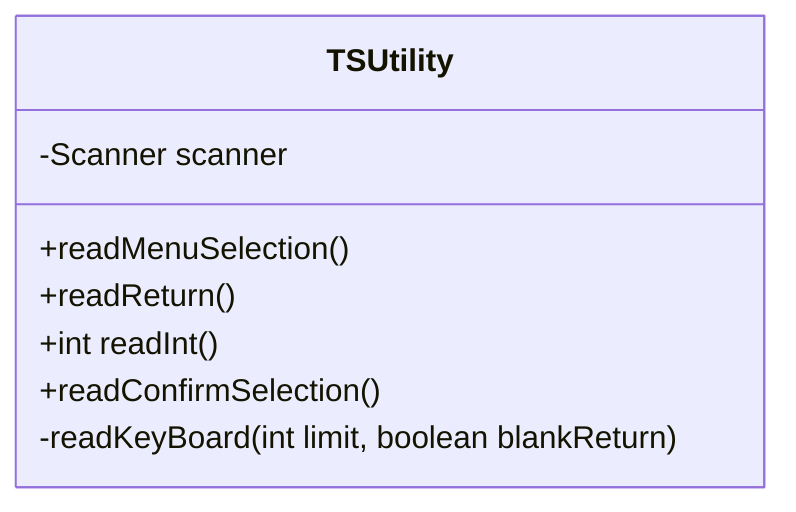

# 尚硅谷课程项目三（P387-P405）

## MVC三层架构

经典的MVC模型中，M是指业务模型，V是指用户界面，C则是控制器，使用MVC的目的是将业务模型和控制器实现代码分离，从而使同一个程序可以有不同的表现形式。该框架模式具有耦合性低、重用性高、部署快、可维护性高等特点。

## 项目需求说明

实现以下功能：

1. 软件启动时根据给定的数据创建公司部分成员列表
2. 根据现有人员组建一个开发团都开发一个新的项目
3. 组建过程包括将成员插入到团队中，或从团队中删除某成员，还可以列出团队现有成员的列表，其中要求开发团队人员中最多一名架构师，最多两名设计师，最多三名程序员。

## 项目整体框架

## 实现步骤

### 一 TSUtility和Data类的说明

#### Data类

该类通过多维数组预存了员工和设备的信息，起到类似数据库的作用。并定义了一些全局常量，来表示特定意义的值。

```java
    public static final int EMPLOYEE = 10;
    public static final int PROGRAMMER = 11;
    public static final int DESIGNER = 12;
    public static final int ARCHITECT = 13;

    public static final int PC = 21;
    public static final int NOTEBOOK = 22;
    public static final int PRINTER = 23;
	public static final String[][] EMPLOYEES;
    public static final String[][] EQUIPMENTS;
```


#### TSUtility类

该类可用来方便的实现键盘访问。



### Employee及其子类的实现

基本设计架构


具体类设计


### 实现Service包中的类

#### NameListService类


#### TeamService类

### TeamView类

> 实现数据的展示与控制台的交互，实现添加、删除团队成员的可视化表达。作为整个项目的程序入口


