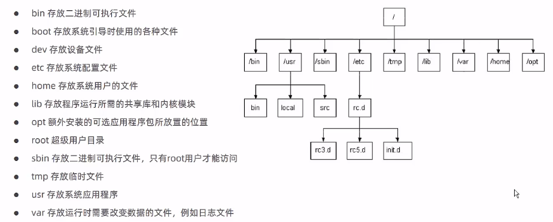

## Linux常用命令

### Linux的文件目录结构

Linux的文件目录结构的最大特点就是**以/为最顶层目录**，所有文件目录都至少从/往下一级。




### 几个常用命令

| 命令           | 英文                 | 作用                   |
| -------------- | -------------------- | ---------------------- |
| ls             | list                 | 查看当前目录下的内容   |
| pwd            | print work directory | 查看当前所在目录       |
| cd [目录名]    | change directory     | 切换目录               |
| touch [文件名] | touch                | 文件名不存在就新建文件 |
| mkdir [目录名] | make directory       | 创建目录               |
| rm [文件名]    | remove               | 删除指定**文件**       |

> `cd ..` ：返回上一层目录

### Linux命令的基本格式

**command [-options] [parameter]**

说明:

* **command**:命令名
* **[-options]**:可选参数,可以对命令进行额外的控制也可以省略
* **[parameter]**:传给命令的参数，可以是零个、一个或多个

> []表示可选。命令名、选项、参数之间由空格进行分隔

### Linux文件编辑命令

Linux目前自带的文本编辑器是Vim编辑器，相当于Windows中的记事本。

使用vim命令打开文件：`vim fileName`

Vim编辑器有三种模式，**命令模式、插入模式和底行模式**

命令模式：

* 使用vim命令打开文件后进入的默认模式
* 可以预览文件内容，但无法编辑
* 可以上下移动光标定位位置

插入模式:

* 可以进行文件内容编辑
* 在命令模式下按`i a o `任意一个键都可以进入插入模式
* 底部有一个``-- Insert --``字样
* 点击`ESC`键可以返回到命令模式

底行模式：

- 底行模式下可以通过命令对文件内容进行查找、显示行号、退出等操作
- 在命令模式下按`:  /`任意一个，可以进入底行模式
- 通过/方式进入底行模式后，可以对文件内容进行查找
- 通过:方式进入底行模式后，可以输入**wq**(保存并退出)、**q!**(不保存退出) **set nu**(显示行号)

### 任务管理相关命令

查询某任务对应的进程号:

```she
ps -ef | grep 任务名
```

根据端口号查询占用端口的应用

```
lsof -i:端口号
```

根据进程号查看对应的端口

```
netstat -anp | grep 进程号
```

