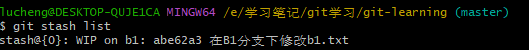

## git基本的工作流


①：`git add 文件名`将文件加入暂存区，未加入暂存区之前，文件都处于`untrack`状态，即不受到git的版本控制管理。可以使用 `git status` 命令查看文件的修改状态，如有某个文件已经修改，则可以选择`git add`添加入暂存区或者`git restore`取消文件的修改。

②：`git commit -m "备注信息"`将暂存区文件提交到本地仓库

③：将本地仓库代码推送同步到远程仓库，首先需要创建远程仓库，以常用的远程仓库代码平台GitHub为例[使用Git工具将本地代码推送到GitHub远程仓库 - 知乎 (zhihu.com)](https://zhuanlan.zhihu.com/p/312875677)，然后使用`git remote add origin SSH地址`命令将本地仓库与远程仓库关联。连接成功后就可以通过`git push -u origin master`命令将本地的master分支推送到远程仓库中。

> 使用`git remote -v` 查看origin远程仓库的具体ssh地址。使用`git commit -a -m "备注信息"`可以将文件一步到位直接提交到本地仓库

④：将远程仓库中的所有文件信息拷贝到本地，使用`git clone 远程仓库url`命令

## git的常见概念

版本库：.git隐藏文件夹就是版本库，版本库中存储了很多配置信息、日志信息和文件版本信息等。

工作区：包含.git文件夹的目录就是工作区，也称为工作目录，主要用于存放开发的代码

暂存区：.git文件夹中的index文件就是暂存区，也叫stage。暂存区是一个临时保存修改文件的地方

## git的分支管理

git的分支管理功能使得它成为团队项目管理的利器。创建分支就是从主项目文件(master分支)中拷贝一个副本过来，然后在这个副本上进行功能的增加和修改，在修改完成后可以申请合并到主项目文件(master)的过程。

### 分支的创建


创建分支,使用`git branch "分支名"`的命令,使用命令后，即在**当前所在的分支**上创建一个该分支的副本到新分支上，然后使用`git checkout 分支名`切换到新分支上，在新分支上进行版本功能更迭。

### 分支的合并

将某个分支所更改的内容合并到另一个分支中，使用`git merge`命令，如使用`git merge master`表示将master分支合并到当前分支上。


​												上图是将从分支1合并到master主分支上

#### 分支合并带来的冲突问题

有这么一种情况，分支B从分支A中拷贝产生到分支B合并到分支A这段时间，**两个分支对同一个文件内容都进行了修改**，此时将分支B合并到分支A会产生冲突，需要手动解决冲突并提交更改。


​		`git merge 从分支1`时，由于master分支在从分支1创建后又增加了新的版本，所以合并时会产生冲突

## Git常用命令

### Git全局设置

安装Git后首先要做的事情要设置用户名称和email名称，因此每次git提交都会使用该用户信息。

​	全局设置用户信息(邮箱/用户名)

* ```git config --global user.name "用户名"```
* ```git config --global user.email "邮箱名"```
* ```git config -- list```	 查看配置信息

### 获取git仓库

获取Git仓库通常有两种方式:

* 在本地初始化一个Git仓库 `git init`
* 从远程仓库克隆 `git clone 远程仓库地址`

### 本地仓库常用操作命令

#### 查看文件状态

`git status`

文件有两种状态：

未被追踪状态(untracked):未被纳入版本控制

已跟踪状态(tracked):	(被纳入版本控制)

* Unmodified 未修改状态
* Modified 已修改状态
* Staged 已暂存状态

#### 取消暂存或切换版本

`git reset`：

* 将暂存区文件**取消暂存**    `git reset 文件名`
* 将本地仓库**切换到指定版本**   `git reset --hard commit提交地址`    commit版本提交地址可以通过`git log`查询

#### 查看日志

`git log`

查看每次commit提交的记录。


#### 提交

`git commit -m`:将暂存区中的文件修改提交到本地版本库中

### 远程仓库操作常用操作命令

#### 查看关联的远程仓库

`git remote -v`:可以找到与本地仓库关联的远程服务器地址

#### 关联远程仓库

`git remote add origin 远程仓库url`:将本次初始化的仓库与远程某个已创建的仓库进行关联

#### 推送至远程仓库

`git push origin 本地仓库分支名` 

将本地仓库内容推送至远程仓库。

#### 从远程仓库拉取

`git pull origin 本地仓库分支名`

`git pull`的作用是从远程仓库获取最新版本并合并到本地仓库

> 如果当前本地仓库不是从远程仓库克隆，而是本地创建的仓库然后再与远程仓库关联的，并且仓库中存在文件，此时再从远程仓库拉取文件的时候会报错(fatal:refusing to merge unrelated histories)。解决此问题可以在git pull命令后加入参数 --allow-unrelated-histories。

### 分支操作

分支是git使用过程中非常重要的概念。使用分支可以将代码在自己的分支上进行从而避免主分支的开发。同一个仓库有多个分支，各个分支相互独立，互不干扰。

创建本地仓库时默认会创建一个master分支。

#### 查看分支

`git branch`:列出所有本地分支

`git branch -r`:列出所有远程分支

`git branch -a`:列出所有本地分支和远程分支

#### 创建分支

`git branch` 分支名

#### 切换分支

`git checkout 分支名`

> 在切换分支时，必须保证该分支下的文件修改已经commit，否则无法切换

#### 推送至远程仓库分支

`git push origin 远程分支名`

#### 合并分支

`git merge 分支名`

将分支名合并到当前分支

#### 删除分支

`git branch -d 分支名`

> 注：不能在当前分支下删除当前分支

### 标签操作

标签，记录某个分支在一个时间节点的状态（相当于对于该个分支的快照）。通过标签，可以很方便的切换到标记时的状态。最常见的就是使用标签来记录软件发布的不同版本(V1.0 V2.0)

`git tag`:查看标签

`git tag 标签名`:创建标签

`git push origin 标签名`:将标签名推送至远程仓库

`git checkout -b 分支名 标签名`:检出标签。检出标签时需要新建一个分支来指向某个标签

### 隐藏工作区更改内容

在git的实际应用场景中，经常会出现**你现在正在开发的分支功能尚未开发完成，但是需要先切换到其他分支去解决bug或者开发优先级更高的功能**的情况。

如果你采用`git add`将未开发完成的文件commit提交，然后切换到其他分支开发。但是你提交的内容并不是完全开发好的功能，如果出现bug的话需要回滚，且回滚到commit提交前的状态，这样就会导致你开发的一部分内容也丢失了。

针对这类场景，可以采用**`git stash`**命令，在**切换分支前，使用该命令将当前分支中工作区的内容隐藏起来**，放到一个隐藏列表中，可以使用**git stash list**命令查看已隐藏内容的列表信息



其中@{0}:代表stash列表的索引,;WIP on b1 表示在b1分支下隐藏的内容 ;abe62a3表示标识号。

在解决完其他分支的问题后，回到原来的分支上时，你可以把在该分支隐藏的内容取出来，使用`git stash pop`或者`git statsh apply`，前者是释放列表中的第一个隐藏内容并删除，后者是释放列表中第一个隐藏内容，但不删除。
