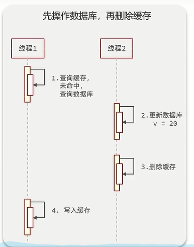
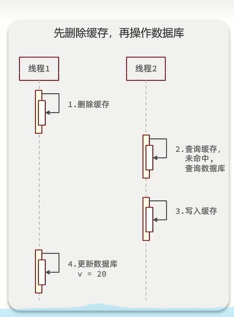
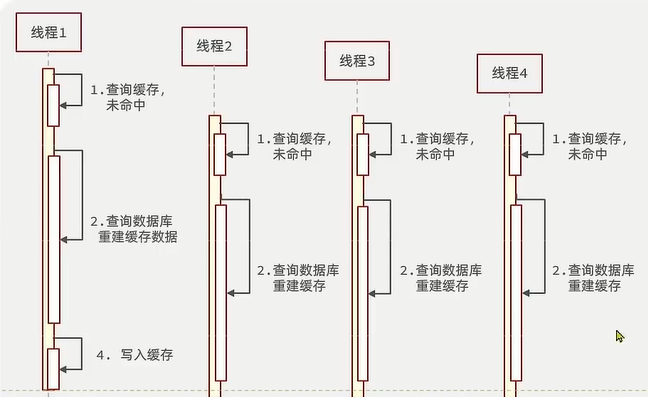
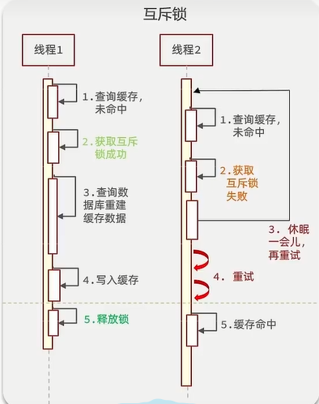
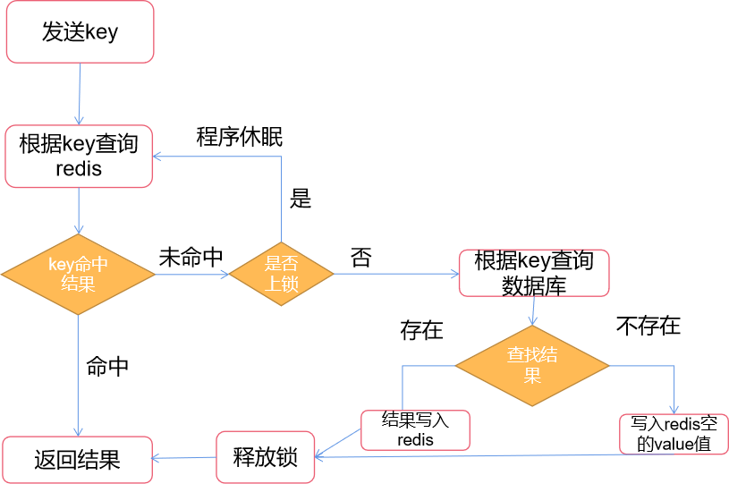
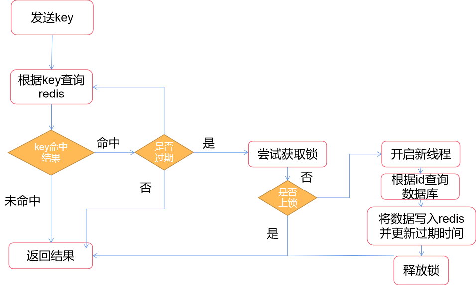

## 缓存

缓存的定义：临时存放数据的区域

缓存的好处：

* 利用提高查询读取性能

缓存的缺点：

* 数据一致性:缓存数据和数据库数据由于不是同步更新的原因，会导致缓存数据和数据库中的数据不一致。此时当用户查询数据，如果返回的是缓存数据，则会出现数据错误。
* 运维成本

### 缓存更新策略

由于数据一致性的问题存在，我们需要合适的缓存更新策略来保证数据一致性。

Redis常见的缓存更新策略有内存淘汰机制、超时剔除和主动更新。

| 缓存更新策略 | 内存淘汰机制                              | 超时剔除                                   | 主动更新               |
| ------------ | ----------------------------------------- | ------------------------------------------ | ---------------------- |
| 具体内容     | 利用redis自身的淘汰机制，随机剔除缓存数据 | 存放redis是设置TTL，到期时间过了后自动删除 | 在代码逻辑层面进行更新 |
| 使用场景     | 低一致性需求                              | 低一致性需求                               | 高一致性需求           |

在实际生产场景中，保证高一致性需求的大致方案如下：

读操作时：

1. 缓存存在，返回结果
2. 缓存不存在，查询数据库，将数据写入缓存并设置TTL，返回结果

写操作时：

**先更新数据库，然后再更新缓存**，可以减小线程不安全的可能性



### 缓存更新中的常见问题

#### 缓存穿透

> 缓存穿透就是高并发的情况下，大量无效key请求发送到服务端，redis失效，大量请求都打到数据库，造成数据库压力。

解决方法：

* 校验key的格式是否准确，如果校验出来是错误的，则直接拦截
* redis中缓存无效key，value是空，并设置TTL，防止无效key占用redis的内存空间过多
* 采用布隆过滤器（被布隆过滤器拦截的一定是无效key，但被放行的也有一定几率是无效key）

#### 缓存击穿

> 某个热点key突然失效或过期且该key的缓存重建业务复杂，导致大量访问该key的请求都打到数据库，造成数据库压力



解决方法：

* 采用互斥锁，保证缓存重建业务时，其他查询服务无法进入



* 采用逻辑过期的方法，在key的value中添加一个过期字段，记录的是过期的时间；当请求访问该key时，如果判断已经过期，则仍返回；接着新建一个线程，用于用于缓存重建并更新逻辑过期时间。

采用互斥锁的业务逻辑：



采用逻辑过期的业务逻辑



```java
  public <T,R> T queryWithLogicalExpire(String key_prefix,R keyId,Class<T> clazz,Function<R,T> dbFallBack){
        String key = key_prefix+keyId.toString();
        //根据key查询结果
        String res = stringRedisTemplate.opsForValue().get(key);
        if(StrUtil.isBlank(res)){
            //未命中，直接返回空
            return null;
        }
        //将res反序列化成RedisData对象
        RedisData redisData = JSONUtil.toBean(res, RedisData.class);
        T instance = JSONUtil.toBean((JSONObject) redisData.getData(), clazz);

        //判断是否过期
        if(LocalDateTime.now().isBefore(redisData.getExpireTime())){
            //过期，返回结果
            return instance;
        }

        //未过期，尝试获取锁

        if(isLock(RedisConstants.LOCK_SHOP_KEY,keyId.toString())){
            //已上锁，返回结果
            return instance;
        }

        //未上锁，尝试上锁
        tryLock(RedisConstants.LOCK_SHOP_KEY,keyId.toString());
        //开启新线程
        CACHE_REBUILD_EXECUTOR.submit(() ->{
            try {
                //根据keyId查询数据库
                T t = dbFallBack.apply(keyId);
                //将数据写入redis并更新过期时间
//                setKeyWithLogicalExpire(RedisConstants.CACHE_SHOP_KEY,keyId.toString(),instance,RedisConstants.CACHE_SHOP_TTL,TimeUnit.MINUTES);
                setKeyWithLogicalExpire(RedisConstants.CACHE_SHOP_KEY,keyId.toString(),t,10L,TimeUnit.SECONDS);
            }
            catch (Exception e){
                throw new RuntimeException(e);
            } finally{
                //释放锁
                unLock(RedisConstants.LOCK_SHOP_KEY,keyId.toString());
            }
        });
        //返回结果
        return instance;
    }
```

#### 缓存雪崩

> redis中的大量key集体过期甚至redis服务器宕机，导致大量请求达到数据库

解决方法：

* 随机设置key的TTL值
* 设计redis集群，提高redis可用性
* 给缓存业务添加限流降级策略

