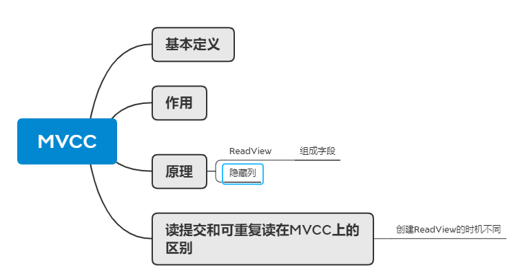
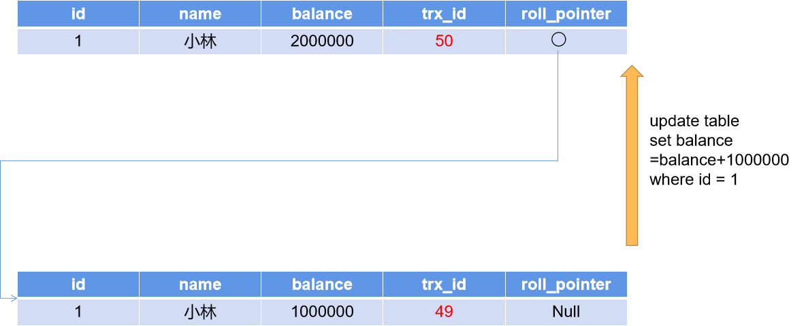

## MySQL中的日志文件被分成了哪几种

## 说一下MVCC机制的原理

MVCC就是多版本并发控制，就是通过**版本链**的方式来控制并发事务访问同一个记录的行为。

MVCC的原理是使用ReadView进行版本控制，使用隐藏列取指定版本数据。

ReadView可以翻译成是数据快照，记录某个时刻下数据库的状态（记录的状态由4部分组成）。

如下图所示：

​										              某个事务创建的ReadView

creator_trx_id:创建该ReadView的事务的事务id

trx_ids:创建该ReadView时，处于活跃状态(已开始但未提交)的事务id列表

min_trx_id:创建该ReadView时，处于活跃状态的最小事务id

max_trx_id:创建该ReadView时，处于活动状态的最大事务id的id值+1

接下来会使用到聚簇索引记录中的隐藏列，隐藏列包含两个字段。一个是trx_id，另一个是roll_pointer。其中trx_id是表示对某条索引记录进行增删改时，该事务的编号；roll_pointer是一个指针，指向未更改前的记录。举一个例子：有一个事务，事务id是50，将小林的账户余额从一百万更新到两百万，更新前的记录是事务49提交的，更新后事务id是50，那么更新成功后的字段就是trx_id为50，roll_pointer指向旧版本的记录。如下图所示：

结合ReadView和隐藏列就可以实现MVCC。具体流程如下：

进行增删改时，读取ReadView和该列记录的隐藏字段trx_id，如果：

1. trx_id小于ReadView中的min_trx_id，说明更改/创建该条记录的事务已经提交，该条记录对当前事务可见
2. trx_id大于等于ReadView中的max_trx_id，说明更改/创建该条记录的事务是在生成ReadView之后生成的，不确定是否提交，所以该条记录对当前事务不可见
3. trx_id大于等于ReadView中的min_trx_id，小于ReadView中的max_trx_id，又有两种情况：
   1. trx_id在m_ids列表中，说明更改/创建该条记录的事务仍在活跃状态中，没有提交，所以该条记录对当前事务不可见
   2. trx_id不在m_ids列表中，说明更改/创建该条记录的事务已经提交，所以该条记录对当前事务可见

可重复读和读已提交都是基于这种判断流程进行工作的，不同的是它们二者**创建readView的时机不同**。可重复读是**在事务开启时就生成一个ReadView直到事务结束都是用这个ReadView**，读已提交就是**每次查询语句时就生成一个最新的ReadView**。

## 索引的类型哪几种？一般情况下选择哪一种？为什么呢？

##  慢SQL应该怎么去排查

## 索引字段是不是建的越多越好

## 一条SELECT的SQL语句的执行过程

## MySQL中常见的数据引擎和区别

InnoDB
1、支持事务。
2、使用的锁粒度默认为行级锁，可以支持更高的并发;也支持表锁。
3、支持外键约束;外键约束其实降低了表的查询速度，增加了表之间的耦合度。
MyISAM
1、不提供事务支持
2、只支持表级锁
3、不支持外键
=、memory
数据存储在内存中
总结:
·MyISAM管理非事务表，提供高速存储和检索以及全文搜索能力，如果在应用中执行大量select操作，应该选择MyISAM
·InnoDB用于事务处理，具有ACID事务支持等特性，如果在应用中执行大量insert和update操作，应该选择InnoDB
