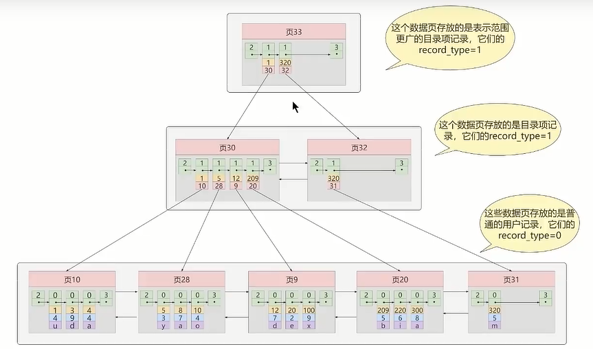
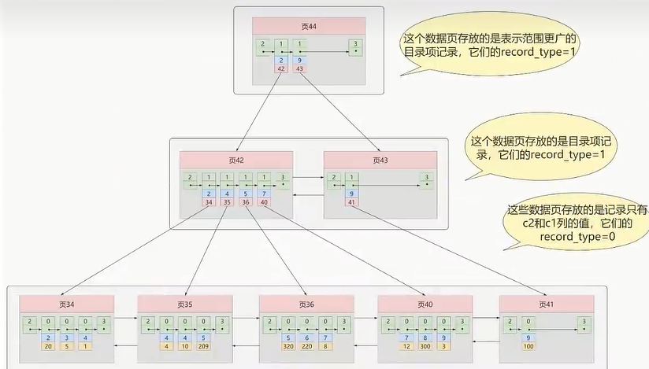
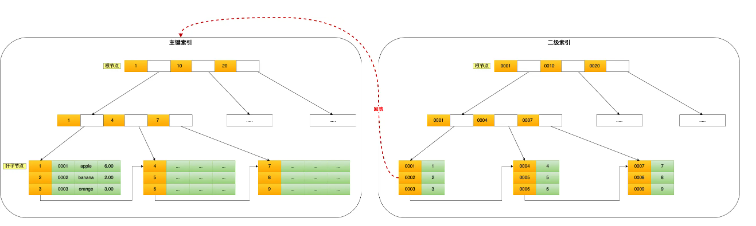
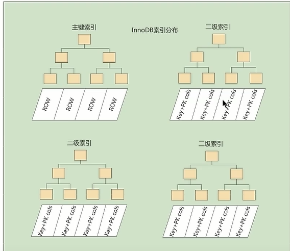
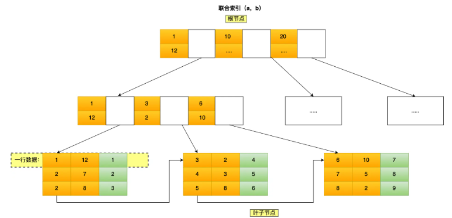
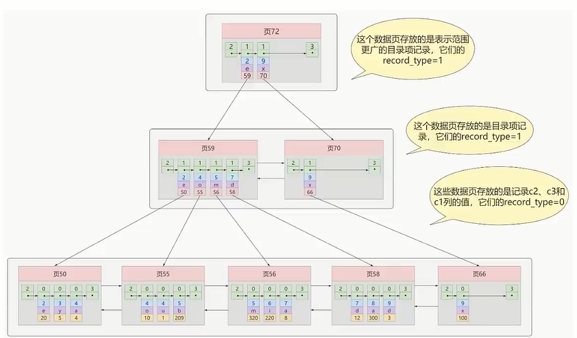
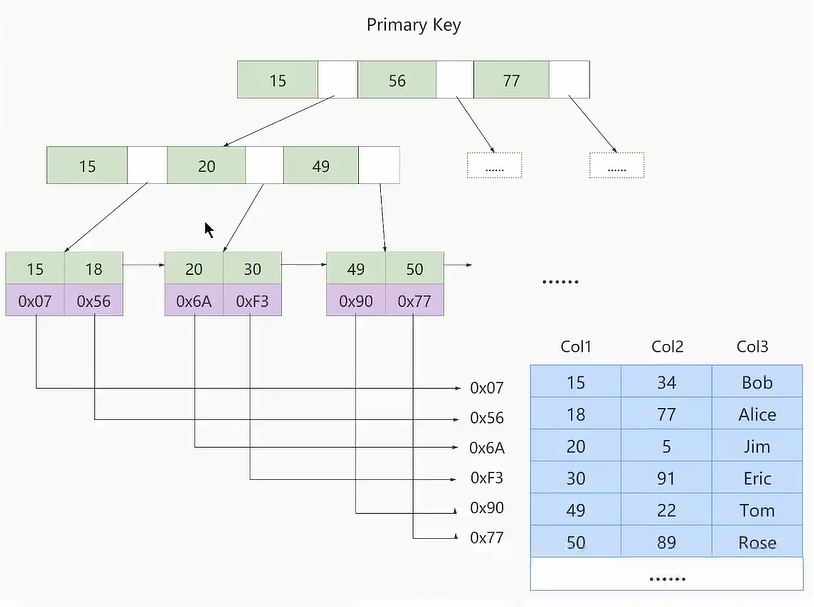
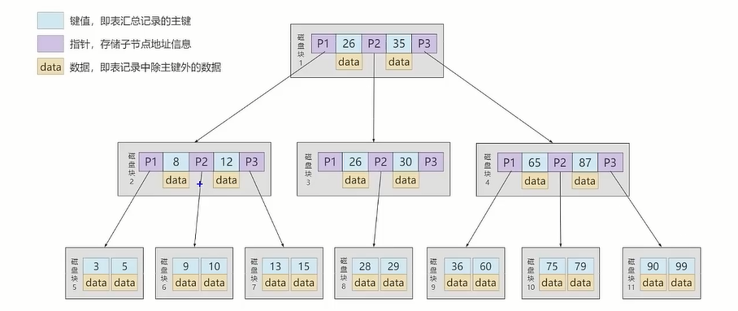
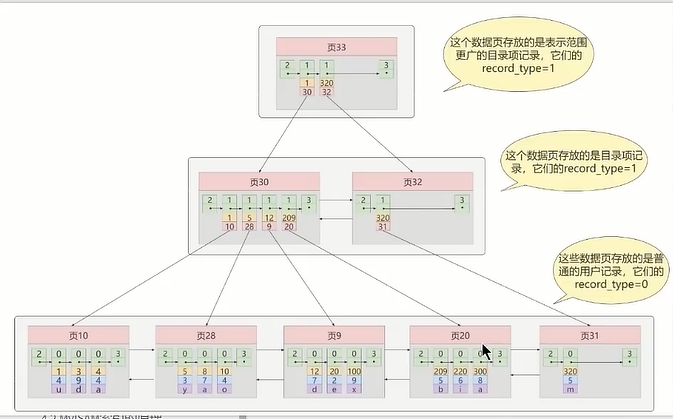

# 索引

> 索引(Index)就是帮助MySQL高效查询数据的数据结构

### 索引的优缺点

索引的优点有：

1. 类似于大学图书馆创建书目索引让读者快速找到书籍，数据库中的索引也是通过减少数据库的io查找次数快速的帮助用户获取到数据
2. 通过创建唯一索引，可以保证数据库表中每一行的数据唯一性
3. 使用group by或者order by，通过创建合适的索引，可以大大提高查询速度

索引的缺点有：

1. 创建和维护索引需要时间
2. 索引需要额外的物理空间进行存储
3. 索引需要动态维护，每次表中数据更新之后需要重新构建索引，所以在提高查询速度的同时也会导致更新速度的降低

### 索引分类

按数据结构分类，可以分成B+树索引、Hash索引、Full-text索引；

不同的存储引擎支持不同的索引类型。


按物理存储来分类，可以分成聚簇索引（或者叫主键索引）和二级索引（或叫做辅助索引）；

​	聚簇索引就是叶子节点中包含数据表的一条完整信息；二级索引在叶子节点中包含索引字段值+主键值。在InnoDB中，创建表时总会创建一个聚簇索引。根据不同的情境选择不同的列

* 如果有主键，默认会使用主键作为聚簇索引的索引键
* 如果没有主键，就会选择第一个不包含NULL值的唯一列作为聚簇索引的索引键
* 上述两种情况都没有，InnoDB会自动生成一个隐式自增id作为聚簇索引的索引键

#### 聚簇索引



所以通过聚簇索引，可直接找到一条数据的所有字段信息；

#### 二级索引



二级索引的中叶子节点存放了一个索引字段+主键值，当我们需要查询索引字段对应的其他字段的值时，我们此时就需要通过索引找到的主键值，再作为主键索引的字段值再一次进行查找，找到所有字段的值。这个过程就做**回表**，需要两颗b+树的查询。

具体过程如下：



按字段特性来分类，可以分成主键索引、唯一索引、普通索引和前缀索引；

​	顾名思义：主键索引就是在主键字段上创建索引；唯一索引就是在数据约束是唯一性的字段上创建索引；前缀索引就是选取某个字段的前面部分字段作为索引。   


覆盖索引：//TODO

#### 聚簇索引和二级索引的区别



|          | 聚簇索引                                          | 非聚簇索引                   |
| -------- | ------------------------------------------------- | ---------------------------- |
| 叶子节点 | 记录所有字段信息                                  | 记录索引字段和主键字段       |
| 个数     | 一张表只能一个一个聚簇索引（以主键值/唯一约束值） | 每个普通字段都可创建一个索引 |
| 效率     | 查找效率高，增加、删除效率低                      | 增加、删除、更新修改效率高   |

按字段个数进行分类，可以分成联合索引和单列索引。

​	联合索引就是以多个字段作为索引组，单列索引就是以单个字段作为索引。

#### 联合索引

联合索引就是以多个字段(field1,field2)作为索引组。索引顺序是以field1从小到大进行排序，field1相同则按field2从小到大进行排序。



##### 前缀匹配原则

如果以(a,b,c)作为联合索引，则索引条件中必须以a、a b、a b c这三种情况才能命中索引，否则无法命中。因为索引是按a进行排序，然后按b进行排序，最后按c进行排序，只有a是全局有序，a相同的情况下b局部有序，b相同的情况下c局部有序。所以如果没有对a进行索引，直接对b或者b c索引，将无法快速定位边界条件。

##### 范围查询

对多个字段进行联合索引，不代表所有字段都会命中索引。在有范围查询的条件下，如

```sql
select * from table where  a > 1 and b = 2; 
```

在范围查询字段a能命中索引，范围字段后面的字段b则无法命中。因为在a>1这个范围内，字段b并不有序，索引范围只能覆盖到a而不是(a,b)

### 适合/不适合索引的场景

适合索引的场景有：

1. 有唯一性约束的字段，如主键、流水号等
2. 频繁需要用作where条件查询的字段，如果不止一个字段的话，可以建立联合索引
3. group by 和order by的字段

不适合索引的场景有：

1. 表数据不多的时候
2. 字段的值的类别比较少的，如性别字段，只有男、女两种
3. 频繁增删改的字段，由于要保证B+树的有序性，字段每一次增删改，都需要动态的维护B+树，这会影响数据库性能

### B+树存储结构在Innodb存储引擎和MyISAM存储引擎的区别

按照索引的物理实现方式，可以将索引分为聚簇(聚集)索引和非聚簇索引(又称二级索引或者辅助索引)

B+树存储结构在Innodb和MyISAM存储引擎最大的区别就是在叶子节点处。MyISAM的B+树叶子节点存放物理数据的地址，即所谓的**数据和索引分离**，而Innodb的B+树叶子节点存放物理数据本身，即所谓的**数据即索引**。


​										上述图是一个典型的Innodb存储引擎采用B+树的物理实现方式

基于上图的结构，可以看出聚簇索引的数据存储特点有如下：

1. 使用**基于主键值的大小进行记录和页的排序**

   * 页内的记录是按照主键的大小顺序排成一个**单项链表**
   * 各个存放用户记录的页也是根据页中用户记录的主键大小顺序排成一个**双向链表**
   * 存放目录项记录的页分为不同的层次，在同一层次中的页也是根据页中目录项记录的主键大小顺序排成一个双向链表

2. B+树的叶子节点存储的是完整的用户记录

   所谓完整的用户记录，就是指这个记录中存储了所有列的指（包括隐藏列）

3. 聚簇索引是默认创建的，不需要使用index语句进行显式的创建，InnoDB存储引擎会自动创建

#### 优点

* 数据访问速度快，因为聚簇索引将索引和数据保存在同一个B+树中（索引即数据）
* 聚簇索引对于主键的**排序查找**和**范围查找**速度非常快

#### 缺点

* 插入速度依赖于插入顺序，如插入的主键值不规律，需要进行频繁的页插入和页分裂，严重影响性能。所以，对于InnoDB表，我们一般都会定义一个**自增的ID列为主键**
* 更新主键的代价很高，所以在InnoDB中，一般定义为主键不可更新

### 非聚簇索引

非聚簇索引(又称二级索引或者辅助索引)是以**其他非主键字段**作为索引字段，并且叶子节点中不包含所有字段的值（一般包含索引字段的值和主键字段）


上图中，就是一个非聚簇索引的结构示意图，采用C2列作为索引字段，叶子节点的页目录项是C2列和主键列。			

注：一张表有一张聚簇索引，可以有多张非聚簇索引。聚簇索引的叶子节点存放数据列的所有信息，非聚簇索引的叶子节点只存放索引列的值和主键列的值，通过非聚簇索引查询所有字段的值需要进行**回表操作**，将非聚簇索引查找到的主键字段值作为查询条件，重新回到聚簇索引的B+树中进行再一次的查询才能获取到所有字段的值。


### 联合索引



​												上图中以C2列和C3列作为联合索引列		

联合索引，**两个及以上的字段作为索引组合**。叶子节点只存放索引组合列的值以及主键值。索引组合的数据的第一排序字段相同的情况下，看第二排序字段的大小，以此类推。

## MyISAM存储引擎



MyISAM索引原理，索引和数据文件分离。索引项是表的主键字段，通过索引得到数据文件的地址从而获得所有数据项信息。


## B树和B+树

### B树和B+树的区别



​																						B树


	

​																			B+树

1. B+树的非叶子节点的节点数=它的叶子节点数,且非叶子节点只存放子节点的地址信息；B树的非叶子节点的节点数=它的叶子节点数减一，且非叶子节点可以存放具体数据。
2. B树的数据信息可以在非叶子节点；B+树的数据信息都在叶子节点上，数据页内按从小到大以链表相连，B树的部分数据信息在非叶子节点上。

### B+树的特点

1. 查询的信息数据都在叶子节点上，**查询效率更加稳定**;
2. **更适合范围查询**，因为叶子节点的数据信息都是由小到大以链表链接，可以快速查到范围内的数据；而B树查找某个范围内的数据需要中序遍历不同节点上的值;
3. B+树往往更加矮胖（深度低，阶数高），需要的磁盘IO次数更少，所以**查询效率更高**；
4. B+树在一个数据页块中存储的信息更多，因为目录页只存放主键和地址值，而B树中目录页中也会存放完整的数据信息；

