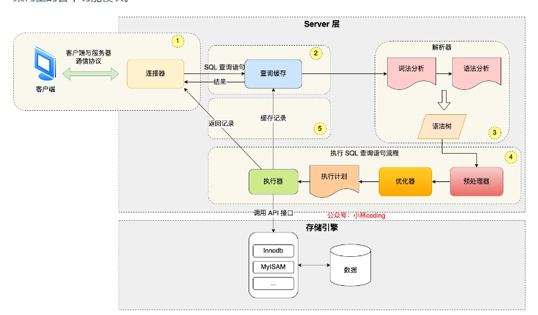

## 逻辑架构

### sql语句在服务器中的执行流程

查询缓存：将执行成功的SQL语句查询结果缓存起来，当同样的SQL语句执行时，可以直接从缓存中取出

语法器：确当sql语法是否符合规范，如果语法有误返回错误结果，语法正确则生成一棵语法树

优化器：确定sql语句的最优的执行路径，比如是根据全表检索还是索引检索等

执行器：基于上一步优化器生成的执行路径，进行具体的执行操作。在执行之前需要判断该用户是否**具备权限**。如果没有就会返回权限错误，如果具备权限，就执行SQL查询并返回结果。在设置了查询缓存的情况下，还会将查询结果进行缓存。具体的执行实现会基于不同的存储引擎，调用不同引擎的API接口进行实现。